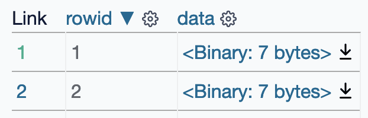

.. _binary:

=============
 Binary data
=============

SQLite tables can contain binary data in ``BLOB`` columns.

Datasette includes special handling for these binary values. The Datasette interface detects binary values and provides a link to download their content, for example on https://latest.datasette.io/fixtures/binary_data

Binary data is represented in ``.json`` exports using Base64 encoding.

https://latest.datasette.io/fixtures/binary_data.json?_shape=array

.. code-block:: json

    [
        {
            "rowid": 1,
            "data": {
                "$base64": true,
                "encoded": "FRwCx60F/g=="
            }
        },
        {
            "rowid": 2,
            "data": {
                "$base64": true,
                "encoded": "FRwDx60F/g=="
            }
        },
        {
            "rowid": 3,
            "data": null
        }
    ]

.. _binary_linking:

Linking to binary downloads
---------------------------

The ``.blob`` output format is used to return binary data. It requires a ``_blob_column=`` query string argument specifying which BLOB column should be downloaded, for example:

https://latest.datasette.io/fixtures/binary_data/1.blob?_blob_column=data

This output format can also be used to return binary data from an arbitrary SQL query. Since such queries do not specify an exact row, an additional ``?_blob_hash=`` parameter can be used to specify the SHA-256 hash of the value that is being linked to.

Consider the query ``select data from binary_data`` - `demonstrated here <https://latest.datasette.io/fixtures?sql=select+data+from+binary_data>`__.

That page links to the binary value downloads. Those links look like this:

https://latest.datasette.io/fixtures.blob?sql=select+data+from+binary_data&_blob_column=data&_blob_hash=f3088978da8f9aea479ffc7f631370b968d2e855eeb172bea7f6c7a04262bb6d

These ``.blob`` links are also returned in the ``.csv`` exports Datasette provides for binary tables and queries, since the CSV format does not have a mechanism for representing binary data.

Binary plugins
--------------

Several Datasette plugins are available that change the way Datasette treats binary data.

- `datasette-render-binary <https://github.com/simonw/datasette-render-binary>`__ modifies Datasette's default interface to show an automatic guess at what type of binary data is being stored, along with a visual representation of the binary value that displays ASCII strings directly in the interface.
- `datasette-render-images <https://github.com/simonw/datasette-render-images>`__ detects common image formats and renders them as images directly in the Datasette interface.
- `datasette-media <https://github.com/simonw/datasette-media>`__ allows Datasette interfaces to be configured to serve binary files from configured SQL queries, and includes the ability to resize images directly before serving them.
