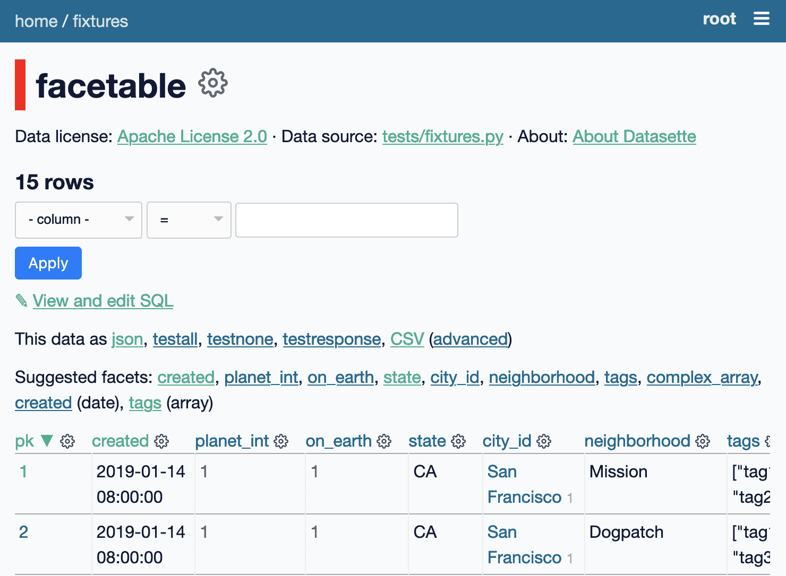

.. _changelog:

=========
Changelog
=========

.. _v0_64_8:

0.64.8 (2023-06-21)
-------------------

- Security improvement: 404 pages used to reflect content from the URL path, which could be used to display misleading information to Datasette users. 404 errors no longer display additional information from the URL. (:issue:`2359`)
- Backported a better fix for correctly extracting named parameters from canned query SQL against SQLite 3.46.0. (:issue:`2353`)

.. _v0_64_7:

0.64.7 (2023-06-12)
-------------------

- Fixed a bug where canned queries with named parameters threw an error when run against SQLite 3.46.0. (:issue:`2353`)

.. _v0_64_6:

0.64.6 (2023-12-22)
-------------------

- Fixed a bug where CSV export with expanded labels could fail if a foreign key reference did not correctly resolve. (:issue:`2214`)

.. _v0_64_5:

0.64.5 (2023-10-08)
-------------------

- Dropped dependency on ``click-default-group-wheel``, which could cause a dependency conflict. (:issue:`2197`)

.. _v0_64_4:

0.64.4 (2023-09-21)
-------------------

- Fix for a crashing bug caused by viewing the table page for a named in-memory database. (:issue:`2189`)

.. _v0_64_3:

0.64.3 (2023-04-27)
-------------------

- Added ``pip`` and ``setuptools`` as explicit dependencies. This fixes a bug where Datasette could not be installed using `Rye <https://github.com/mitsuhiko/rye>`__. (:issue:`2065`)

.. _v0_64_2:

0.64.2 (2023-03-08)
-------------------

- Fixed a bug with ``datasette publish cloudrun`` where deploys all used the same Docker image tag. This was mostly inconsequential as the service is deployed as soon as the image has been pushed to the registry, but could result in the incorrect image being deployed if two different deploys for two separate services ran at exactly the same time. (:issue:`2036`)

.. _v0_64_1:

0.64.1 (2023-01-11)
-------------------

- Documentation now links to a current source of information for installing Python 3. (:issue:`1987`)
- Incorrectly calling the Datasette constructor using ``Datasette("path/to/data.db")`` instead of ``Datasette(["path/to/data.db"])`` now returns a useful error message. (:issue:`1985`)

.. _v0_64:

0.64 (2023-01-09)
-----------------

- Datasette now **strongly recommends against allowing arbitrary SQL queries if you are using SpatiaLite**. SpatiaLite includes SQL functions that could cause the Datasette server to crash. See :ref:`spatialite` for more details.
- New :ref:`setting_default_allow_sql` setting, providing an easier way to disable all arbitrary SQL execution by end users: ``datasette --setting default_allow_sql off``. See also :ref:`authentication_permissions_execute_sql`. (:issue:`1409`)
- `Building a location to time zone API with SpatiaLite <https://datasette.io/tutorials/spatialite>`__ is a new Datasette tutorial showing how to safely use SpatiaLite to create a location to time zone API.
- New documentation about :ref:`how to debug problems loading SQLite extensions <installation_extensions>`. The error message shown when an extension cannot be loaded has also been improved. (:issue:`1979`)
- Fixed an accessibility issue: the ``<select>`` elements in the table filter form now show an outline when they are currently focused. (:issue:`1771`)

.. _v0_63_3:

0.63.3 (2022-12-17)
-------------------

- Fixed a bug where ``datasette --root``, when running in Docker, would only output the URL to sign in as root when the server shut down, not when it started up. (:issue:`1958`)
- You no longer need to ensure ``await datasette.invoke_startup()`` has been called in order for Datasette to start correctly serving requests - this is now handled automatically the first time the server receives a request. This fixes a bug experienced when Datasette is served directly by an ASGI application server such as Uvicorn or Gunicorn. It also fixes a bug with the `datasette-gunicorn <https://datasette.io/plugins/datasette-gunicorn>`__ plugin. (:issue:`1955`)

.. _v0_63_2:

0.63.2 (2022-11-18)
-------------------

- Fixed a bug in ``datasette publish heroku`` where deployments failed due to an older version of Python being requested. (:issue:`1905`)
- New ``datasette publish heroku --generate-dir <dir>`` option for generating a Heroku deployment directory without deploying it.

.. _v0_63_1:

0.63.1 (2022-11-10)
-------------------

- Fixed a bug where Datasette's table filter form would not redirect correctly when run behind a proxy using the :ref:`base_url <setting_base_url>` setting. (:issue:`1883`)
- SQL query is now shown wrapped in a ``<textarea>`` if a query exceeds a time limit. (:issue:`1876`)
- Fixed an intermittent "Too many open files" error while running the test suite. (:issue:`1843`)
- New :ref:`database_close` internal method.

.. _v0_63:

0.63 (2022-10-27)
-----------------

See `Datasette 0.63: The annotated release notes <https://simonwillison.net/2022/Oct/27/datasette-0-63/>`__ for more background on the changes in this release.

Features
~~~~~~~~

- Now tested against Python 3.11. Docker containers used by ``datasette publish`` and ``datasette package`` both now use that version of Python. (:issue:`1853`)
- ``--load-extension`` option now supports entrypoints. Thanks, Alex Garcia. (`#1789 <https://github.com/simonw/datasette/pull/1789>`__)
- Facet size can now be set per-table with the new ``facet_size`` table metadata option. (:issue:`1804`)
- The :ref:`setting_truncate_cells_html` setting now also affects long URLs in columns. (:issue:`1805`)
- The non-JavaScript SQL editor textarea now increases height to fit the SQL query. (:issue:`1786`)
- Facets are now displayed with better line-breaks in long values. Thanks, Daniel Rech. (`#1794 <https://github.com/simonw/datasette/pull/1794>`__)
- The ``settings.json`` file used in :ref:`config_dir` is now validated on startup. (:issue:`1816`)
- SQL queries can now include leading SQL comments, using ``/* ... */`` or ``-- ...`` syntax. Thanks,  Charles Nepote. (:issue:`1860`)
- SQL query is now re-displayed when terminated with a time limit error. (:issue:`1819`)
- The :ref:`inspect data <performance_inspect>` mechanism is now used to speed up server startup - thanks, Forest Gregg. (:issue:`1834`)
- In :ref:`config_dir` databases with filenames ending in ``.sqlite`` or ``.sqlite3`` are now automatically added to the Datasette instance. (:issue:`1646`)
- Breadcrumb navigation display now respects the current user's permissions. (:issue:`1831`)

Plugin hooks and internals
~~~~~~~~~~~~~~~~~~~~~~~~~~

- The :ref:`plugin_hook_prepare_jinja2_environment` plugin hook now accepts an optional ``datasette`` argument. Hook implementations can also now return an ``async`` function which will be awaited automatically. (:issue:`1809`)
- ``Database(is_mutable=)`` now defaults to ``True``. (:issue:`1808`)
- The :ref:`datasette.check_visibility() <datasette_check_visibility>` method now accepts an optional ``permissions=`` list, allowing it to take multiple permissions into account at once when deciding if something should be shown as public or private. This has been used to correctly display padlock icons in more places in the Datasette interface. (:issue:`1829`)
- Datasette no longer enforces upper bounds on its dependencies. (:issue:`1800`)

Documentation
~~~~~~~~~~~~~

- New tutorial: `Cleaning data with sqlite-utils and Datasette <https://datasette.io/tutorials/clean-data>`__.
- Screenshots in the documentation are now maintained using `shot-scraper <https://shot-scraper.datasette.io/>`__, as described in `Automating screenshots for the Datasette documentation using shot-scraper <https://simonwillison.net/2022/Oct/14/automating-screenshots/>`__. (:issue:`1844`)
- More detailed command descriptions on the :ref:`CLI reference <cli_reference>` page. (:issue:`1787`)
- New documentation on :ref:`deploying_openrc` - thanks, Adam Simpson. (`#1825 <https://github.com/simonw/datasette/pull/1825>`__)

.. _v0_62:

0.62 (2022-08-14)
-------------------

Datasette can now run entirely in your browser using WebAssembly. Try out `Datasette Lite <https://lite.datasette.io/>`__, take a look `at the code <https://github.com/simonw/datasette-lite>`__ or read more about it in `Datasette Lite: a server-side Python web application running in a browser <https://simonwillison.net/2022/May/4/datasette-lite/>`__.

Datasette now has a `Discord community <https://discord.gg/ktd74dm5mw>`__ for questions and discussions about Datasette and its ecosystem of projects.

Features
~~~~~~~~

- Datasette is now compatible with `Pyodide <https://pyodide.org/>`__.  This is the enabling technology behind `Datasette Lite <https://lite.datasette.io/>`__. (:issue:`1733`)
- Database file downloads now implement conditional GET using ETags. (:issue:`1739`)
- HTML for facet results and suggested results has been extracted out into new templates ``_facet_results.html`` and ``_suggested_facets.html``. Thanks, M. Nasimul Haque. (`#1759 <https://github.com/simonw/datasette/pull/1759>`__)
- Datasette now runs some SQL queries in parallel. This has limited impact on performance, see `this research issue <https://github.com/simonw/datasette/issues/1727>`__ for details.
- New ``--nolock`` option for ignoring file locks when opening read-only databases. (:issue:`1744`)
- Spaces in the database names in URLs are now encoded as ``+`` rather than ``~20``. (:issue:`1701`)
- ``<Binary: 2427344 bytes>`` is now displayed as ``<Binary: 2,427,344 bytes>`` and is accompanied by tooltip showing "2.3MB". (:issue:`1712`)
- The base Docker image used by ``datasette publish cloudrun``, ``datasette package`` and the `official Datasette image <https://hub.docker.com/datasetteproject/datasette>`__ has been upgraded to ``3.10.6-slim-bullseye``.  (:issue:`1768`)
- Canned writable queries against immutable databases now show a warning message. (:issue:`1728`)
- ``datasette publish cloudrun`` has a new ``--timeout`` option which can be used to increase the time limit applied by the Google Cloud build environment. Thanks, Tim Sherratt. (`#1717 <https://github.com/simonw/datasette/pull/1717>`__)
- ``datasette publish cloudrun`` has new ``--min-instances`` and ``--max-instances`` options. (:issue:`1779`)

Plugin hooks
~~~~~~~~~~~~

- New plugin hook: :ref:`handle_exception() <plugin_hook_handle_exception>`, for custom handling of exceptions caught by Datasette. (:issue:`1770`)
- The :ref:`render_cell() <plugin_hook_render_cell>` plugin hook is now also passed a ``row`` argument, representing the ``sqlite3.Row`` object that is being rendered. (:issue:`1300`)
- The :ref:`configuration directory <config_dir>` is now stored in ``datasette.config_dir``, making it available to plugins. Thanks, Chris Amico. (`#1766 <https://github.com/simonw/datasette/pull/1766>`__)

Bug fixes
~~~~~~~~~

- Don't show the facet option in the cog menu if faceting is not allowed. (:issue:`1683`)
- ``?_sort`` and ``?_sort_desc`` now work if the column that is being sorted has been excluded from the query using ``?_col=`` or ``?_nocol=``. (:issue:`1773`)
- Fixed bug where ``?_sort_desc`` was duplicated in the URL every time the Apply button was clicked. (:issue:`1738`)

Documentation
~~~~~~~~~~~~~

- Examples in the documentation now include a copy-to-clipboard button. (:issue:`1748`)
- Documentation now uses the `Furo <https://github.com/pradyunsg/furo>`__ Sphinx theme. (:issue:`1746`)
- Code examples in the documentation are now all formatted using Black. (:issue:`1718`)
- ``Request.fake()`` method is now documented, see :ref:`internals_request`.
- New documentation for plugin authors: :ref:`testing_plugins_register_in_test`. (:issue:`903`)

.. _v0_61_1:

0.61.1 (2022-03-23)
-------------------

- Fixed a bug where databases with a different route from their name (as used by the `datasette-hashed-urls plugin <https://datasette.io/plugins/datasette-hashed-urls>`__) returned errors when executing custom SQL queries. (:issue:`1682`)

.. _v0_61:

0.61 (2022-03-23)
-----------------

In preparation for Datasette 1.0, this release includes two potentially backwards-incompatible changes. Hashed URL mode has been moved to a separate plugin, and the way Datasette generates URLs to databases and tables with special characters in their name such as ``/`` and ``.`` has changed.

Datasette also now requires Python 3.7 or higher.

- URLs within Datasette now use a different encoding scheme for tables or databases that include "special" characters outside of the range of ``a-zA-Z0-9_-``. This scheme is explained here: :ref:`internals_tilde_encoding`. (:issue:`1657`)
- Removed hashed URL mode from Datasette. The new ``datasette-hashed-urls`` plugin can be used to achieve the same result, see :ref:`performance_hashed_urls` for details. (:issue:`1661`)
- Databases can now have a custom path within the Datasette instance that is independent of the database name, using the ``db.route`` property. (:issue:`1668`)
- Datasette is now covered by a `Code of Conduct <https://github.com/simonw/datasette/blob/main/CODE_OF_CONDUCT.md>`__. (:issue:`1654`)
- Python 3.6 is no longer supported. (:issue:`1577`)
- Tests now run against Python 3.11-dev. (:issue:`1621`)
- New :ref:`datasette.ensure_permissions(actor, permissions) <datasette_ensure_permissions>` internal method for checking multiple permissions at once. (:issue:`1675`)
- New :ref:`datasette.check_visibility(actor, action, resource=None) <datasette_check_visibility>` internal method for checking if a user can see a resource that would otherwise be invisible to unauthenticated users. (:issue:`1678`)
- Table and row HTML pages now include a ``<link rel="alternate" type="application/json+datasette" href="...">`` element and return a ``Link: URL; rel="alternate"; type="application/json+datasette"`` HTTP header pointing to the JSON version of those pages. (:issue:`1533`)
- ``Access-Control-Expose-Headers: Link`` is now added to the CORS headers, allowing remote JavaScript to access that header.
- Canned queries are now shown at the top of the database page, directly below the SQL editor. Previously they were shown at the bottom, below the list of tables. (:issue:`1612`)
- Datasette now has a default favicon. (:issue:`1603`)
- ``sqlite_stat`` tables are now hidden by default. (:issue:`1587`)
- SpatiaLite tables ``data_licenses``, ``KNN`` and ``KNN2`` are now hidden by default. (:issue:`1601`)
- SQL query tracing mechanism now works for queries executed in ``asyncio`` sub-tasks, such as those created by ``asyncio.gather()``. (:issue:`1576`)
- :ref:`internals_tracer` mechanism is now documented.
- Common Datasette symbols can now be imported directly from the top-level ``datasette`` package, see :ref:`internals_shortcuts`. Those symbols are ``Response``, ``Forbidden``, ``NotFound``, ``hookimpl``, ``actor_matches_allow``. (:issue:`957`)
- ``/-/versions`` page now returns additional details for libraries used by SpatiaLite. (:issue:`1607`)
- Documentation now links to the `Datasette Tutorials <https://datasette.io/tutorials>`__.
- Datasette will now also look for SpatiaLite in ``/opt/homebrew`` - thanks, Dan Peterson. (`#1649 <https://github.com/simonw/datasette/pull/1649>`__)
- Fixed bug where :ref:`custom pages <custom_pages>` did not work on Windows. Thanks, Robert Christie. (:issue:`1545`)
- Fixed error caused when a table had a column named ``n``. (:issue:`1228`)

.. _v0_60_2:

0.60.2 (2022-02-07)
-------------------

- Fixed a bug where Datasette would open the same file twice with two different database names if you ran ``datasette file.db file.db``. (:issue:`1632`)

.. _v0_60_1:

0.60.1 (2022-01-20)
-------------------

- Fixed a bug where installation on Python 3.6 stopped working due to a change to an underlying dependency. This release can now be installed on Python 3.6, but is the last release of Datasette that will support anything less than Python 3.7. (:issue:`1609`)

.. _v0_60:

0.60 (2022-01-13)
-----------------

Plugins and internals
~~~~~~~~~~~~~~~~~~~~~

- New plugin hook: :ref:`plugin_hook_filters_from_request`, which runs on the table page and can be used to support new custom query string parameters that modify the SQL query. (:issue:`473`)
- Added two additional methods for writing to the database: :ref:`database_execute_write_script` and :ref:`database_execute_write_many`. (:issue:`1570`)
- The :ref:`db.execute_write() <database_execute_write>` internal method now defaults to blocking until the write operation has completed. Previously it defaulted to queuing the write and then continuing to run code while the write was in the queue. (:issue:`1579`)
- Database write connections now execute the :ref:`plugin_hook_prepare_connection` plugin hook. (:issue:`1564`)
- The ``Datasette()`` constructor no longer requires the ``files=`` argument, and is now documented at :ref:`internals_datasette`. (:issue:`1563`)
- The tracing feature now traces write queries, not just read queries. (:issue:`1568`)
- The query string variables exposed by ``request.args`` will now include blank strings for arguments such as ``foo`` in ``?foo=&bar=1`` rather than ignoring those parameters entirely. (:issue:`1551`)

Faceting
~~~~~~~~

- The number of unique values in a facet is now always displayed. Previously it was only displayed if the user specified ``?_facet_size=max``. (:issue:`1556`)
- Facets of type ``date`` or ``array`` can now be configured in ``metadata.json``, see :ref:`facets_metadata`. Thanks, David Larlet. (:issue:`1552`)
- New ``?_nosuggest=1`` parameter for table views, which disables facet suggestion. (:issue:`1557`)
- Fixed bug where ``?_facet_array=tags&_facet=tags`` would only display one of the two selected facets. (:issue:`625`)

Other small fixes
~~~~~~~~~~~~~~~~~

- Made several performance improvements to the database schema introspection code that runs when Datasette first starts up. (:issue:`1555`)
- Label columns detected for foreign keys are now case-insensitive, so ``Name`` or ``TITLE`` will be detected in the same way as ``name`` or ``title``. (:issue:`1544`)
- Upgraded Pluggy dependency to 1.0. (:issue:`1575`)
- Now using `Plausible analytics <https://plausible.io/>`__ for the Datasette documentation.
- ``explain query plan`` is now allowed with varying amounts of whitespace in the query. (:issue:`1588`)
- New :ref:`cli_reference` page showing the output of ``--help`` for each of the ``datasette`` sub-commands. This lead to several small improvements to the help copy. (:issue:`1594`)
- Fixed bug where writable canned queries could not be used with custom templates.  (:issue:`1547`)
- Improved fix for a bug where columns with a underscore prefix could result in unnecessary hidden form fields. (:issue:`1527`)

.. _v0_59_4:

0.59.4 (2021-11-29)
-------------------

- Fixed bug where columns with a leading underscore could not be removed from the interactive filters list. (:issue:`1527`)
- Fixed bug where columns with a leading underscore were not correctly linked to by the "Links from other tables" interface on the row page. (:issue:`1525`)
- Upgraded dependencies ``aiofiles``, ``black`` and ``janus``.

.. _v0_59_3:

0.59.3 (2021-11-20)
-------------------

- Fixed numerous bugs when running Datasette :ref:`behind a proxy <deploying_proxy>` with a prefix URL path using the :ref:`setting_base_url` setting. A live demo of this mode is now available at `datasette-apache-proxy-demo.datasette.io/prefix/ <https://datasette-apache-proxy-demo.datasette.io/prefix/>`__. (:issue:`1519`, :issue:`838`)
- ``?column__arraycontains=`` and ``?column__arraynotcontains=`` table parameters now also work against SQL views. (:issue:`448`)
- ``?_facet_array=column`` no longer returns incorrect counts if columns contain the same value more than once.

.. _v0_59_2:

0.59.2 (2021-11-13)
-------------------

- Column names with a leading underscore now work correctly when used as a facet. (:issue:`1506`)
- Applying ``?_nocol=`` to a column no longer removes that column from the filtering interface. (:issue:`1503`)
- Official Datasette Docker container now uses Debian Bullseye as the base image. (:issue:`1497`)
- Datasette is four years old today! Here's the `original release announcement <https://simonwillison.net/2017/Nov/13/datasette/>`__ from 2017.

.. _v0_59_1:

0.59.1 (2021-10-24)
-------------------

- Fix compatibility with Python 3.10. (:issue:`1482`)
- Documentation on how to use :ref:`sql_parameters` with integer and floating point values. (:issue:`1496`)

.. _v0_59:

0.59 (2021-10-14)
-----------------

- Columns can now have associated metadata descriptions in ``metadata.json``, see :ref:`metadata_column_descriptions`. (:issue:`942`)
- New :ref:`register_commands() <plugin_hook_register_commands>` plugin hook allows plugins to register additional Datasette CLI commands, e.g. ``datasette mycommand file.db``. (:issue:`1449`)
- Adding ``?_facet_size=max`` to a table page now shows the number of unique values in each facet. (:issue:`1423`)
- Upgraded dependency `httpx 0.20 <https://github.com/encode/httpx/releases/tag/0.20.0>`__ - the undocumented ``allow_redirects=`` parameter to :ref:`internals_datasette_client` is now ``follow_redirects=``, and defaults to ``False`` where it previously defaulted to ``True``. (:issue:`1488`)
- The ``--cors`` option now causes Datasette to return the ``Access-Control-Allow-Headers: Authorization`` header, in addition to ``Access-Control-Allow-Origin: *``. (`#1467 <https://github.com/simonw/datasette/pull/1467>`__)
- Code that figures out which named parameters a SQL query takes in order to display form fields for them is no longer confused by strings that contain colon characters. (:issue:`1421`)
- Renamed ``--help-config`` option to ``--help-settings``. (:issue:`1431`)
- ``datasette.databases`` property is now a documented API. (:issue:`1443`)
- The ``base.html`` template now wraps everything other than the ``<footer>`` in a ``
`` element, to help with advanced CSS customization. (:issue:`1446`)
- The :ref:`render_cell() <plugin_hook_render_cell>` plugin hook can now return an awaitable function. This means the hook can execute SQL queries. (:issue:`1425`)
- :ref:`plugin_register_routes` plugin hook now accepts an optional ``datasette`` argument. (:issue:`1404`)
- New ``hide_sql`` canned query option for defaulting to hiding the SQL query used by a canned query, see :ref:`canned_queries_options`. (:issue:`1422`)
- New ``--cpu`` option for :ref:`datasette publish cloudrun <publish_cloud_run>`. (:issue:`1420`)
- If `Rich <https://github.com/willmcgugan/rich>`__ is installed in the same virtual environment as Datasette, it will be used to provide enhanced display of error tracebacks on the console. (:issue:`1416`)
- ``datasette.utils`` :ref:`internals_utils_parse_metadata` function, used by the new `datasette-remote-metadata plugin <https://datasette.io/plugins/datasette-remote-metadata>`__, is now a documented API. (:issue:`1405`)
- Fixed bug where ``?_next=x&_sort=rowid`` could throw an error. (:issue:`1470`)
- Column cog menu no longer shows the option to facet by a column that is already selected by the default facets in metadata. (:issue:`1469`)

.. _v0_58_1:

0.58.1 (2021-07-16)
-------------------

- Fix for an intermittent race condition caused by the ``refresh_schemas()`` internal function. (:issue:`1231`)

.. _v0_58:

0.58 (2021-07-14)
-----------------

- New ``datasette --uds /tmp/datasette.sock`` option for binding Datasette to a Unix domain socket, see :ref:`proxy documentation <deploying_proxy>` (:issue:`1388`)
- ``"searchmode": "raw"`` table metadata option for defaulting a table to executing SQLite full-text search syntax without first escaping it, see :ref:`full_text_search_advanced_queries`. (:issue:`1389`)
- New plugin hook: :ref:`plugin_hook_get_metadata`, for returning custom metadata for an instance, database or table. Thanks, Brandon Roberts! (:issue:`1384`)
- New plugin hook: :ref:`plugin_hook_skip_csrf`, for opting out of CSRF protection based on the incoming request. (:issue:`1377`)
- The :ref:`menu_links() <plugin_hook_menu_links>`, :ref:`table_actions() <plugin_hook_table_actions>` and :ref:`database_actions() <plugin_hook_database_actions>` plugin hooks all gained a new optional ``request`` argument providing access to the current request. (:issue:`1371`)
- Major performance improvement for Datasette faceting. (:issue:`1394`)
- Improved documentation for :ref:`deploying_proxy` to recommend using ``ProxyPreservehost On`` with Apache. (:issue:`1387`)
- ``POST`` requests to endpoints that do not support that HTTP verb now return a 405 error.
- ``db.path`` can now be provided as a ``pathlib.Path`` object, useful when writing unit tests for plugins. Thanks, Chris Amico. (:issue:`1365`)

.. _v0_57_1:

0.57.1 (2021-06-08)
-------------------

- Fixed visual display glitch with global navigation menu. (:issue:`1367`)
- No longer truncates the list of table columns displayed on the ``/database`` page. (:issue:`1364`)

.. _v0_57:

0.57 (2021-06-05)
-----------------

.. warning::
    This release fixes a `reflected cross-site scripting <https://owasp.org/www-community/attacks/xss/#reflected-xss-attacks>`__ security hole with the ``?_trace=1`` feature. You should upgrade to this version, or to Datasette 0.56.1, as soon as possible. (:issue:`1360`)

In addition to the security fix, this release includes ``?_col=`` and ``?_nocol=`` options for controlling which columns are displayed for a table, ``?_facet_size=`` for increasing the number of facet results returned, re-display of your SQL query should an error occur and numerous bug fixes.

New features
~~~~~~~~~~~~

- If an error occurs while executing a user-provided SQL query, that query is now re-displayed in an editable form along with the error message. (:issue:`619`)
-  New ``?_col=`` and ``?_nocol=`` parameters to show and hide columns in a table, plus an interface for hiding and showing columns in the column cog menu. (:issue:`615`)
- A new ``?_facet_size=`` parameter for customizing the number of facet results returned on a table or view page. (:issue:`1332`)
- ``?_facet_size=max`` sets that to the maximum, which defaults to 1,000 and is controlled by the the :ref:`setting_max_returned_rows` setting. If facet results are truncated the … at the bottom of the facet list now links to this parameter. (:issue:`1337`)
- ``?_nofacet=1`` option to disable all facet calculations on a page, used as a performance optimization for CSV exports and ``?_shape=array/object``. (:issue:`1349`, :issue:`263`)
- ``?_nocount=1`` option to disable full query result counts. (:issue:`1353`)
- ``?_trace=1`` debugging option is now controlled by the new :ref:`setting_trace_debug` setting, which is turned off by default. (:issue:`1359`)

Bug fixes and other improvements
~~~~~~~~~~~~~~~~~~~~~~~~~~~~~~~~

- :ref:`custom_pages` now work correctly when combined with the :ref:`setting_base_url` setting. (:issue:`1238`)
- Fixed intermittent error displaying the index page when the user did not have permission to access one of the tables. Thanks, Guy Freeman. (:issue:`1305`)
- Columns with the name "Link" are no longer incorrectly displayed in bold. (:issue:`1308`)
- Fixed error caused by tables with a single quote in their names. (:issue:`1257`)
- Updated dependencies: ``pytest-asyncio``, ``Black``, ``jinja2``, ``aiofiles``, ``click``, and ``itsdangerous``.
- The official Datasette Docker image now supports ``apt-get install``. (:issue:`1320`)
- The Heroku runtime used by ``datasette publish heroku`` is now ``python-3.8.10``.

.. _v0_56_1:

0.56.1 (2021-06-05)
-------------------

.. warning::
    This release fixes a `reflected cross-site scripting <https://owasp.org/www-community/attacks/xss/#reflected-xss-attacks>`__ security hole with the ``?_trace=1`` feature. You should upgrade to this version, or to Datasette 0.57, as soon as possible. (:issue:`1360`)

.. _v0_56:

0.56 (2021-03-28)
-----------------

Documentation improvements, bug fixes and support for SpatiaLite 5.

- The SQL editor can now be resized by dragging a handle. (:issue:`1236`)
- Fixed a bug with JSON faceting and the ``__arraycontains`` filter caused by tables with spaces in their names. (:issue:`1239`)
- Upgraded ``httpx`` dependency. (:issue:`1005`)
- JSON faceting is now suggested even if a column contains blank strings. (:issue:`1246`)
- New :ref:`datasette.add_memory_database() <datasette_add_memory_database>` method. (:issue:`1247`)
- The :ref:`Response.asgi_send() <internals_response_asgi_send>` method is now documented. (:issue:`1266`)
- The official Datasette Docker image now bundles SpatiaLite version 5. (:issue:`1278`)
- Fixed a ``no such table: pragma_database_list`` bug when running Datasette against SQLite versions prior to SQLite 3.16.0. (:issue:`1276`)
- HTML lists displayed in table cells are now styled correctly. Thanks, Bob Whitelock. (:issue:`1141`, `#1252 <https://github.com/simonw/datasette/pull/1252>`__)
- Configuration directory mode now correctly serves immutable databases that are listed in ``inspect-data.json``. Thanks Campbell Allen and Frankie Robertson. (`#1031 <https://github.com/simonw/datasette/pull/1031>`__, `#1229 <https://github.com/simonw/datasette/pull/1229>`__)

.. _v0_55:

0.55 (2021-02-18)
-----------------

Support for cross-database SQL queries and built-in support for serving via HTTPS.

- The new ``--crossdb`` command-line option causes Datasette to attach up to ten database files to the same ``/_memory`` database connection. This enables cross-database SQL queries, including the ability to use joins and unions to combine data from tables that exist in different database files. See :ref:`cross_database_queries` for details. (:issue:`283`)
- ``--ssl-keyfile`` and ``--ssl-certfile`` options can be used to specify a TLS certificate, allowing Datasette to serve traffic over ``https://`` without needing to run it behind a separate proxy. (:issue:`1221`)
- The ``/:memory:`` page has been renamed (and redirected) to ``/_memory`` for consistency with the new ``/_internal`` database introduced in Datasette 0.54. (:issue:`1205`)
- Added plugin testing documentation on :ref:`testing_plugins_pdb`. (:issue:`1207`)
- The `official Datasette Docker image <https://hub.docker.com/r/datasetteproject/datasette>`__ now uses Python 3.7.10, applying `the latest security fix <https://www.python.org/downloads/release/python-3710/>`__ for that Python version. (:issue:`1235`)

.. _v0_54_1:

0.54.1 (2021-02-02)
-------------------

- Fixed a bug where ``?_search=`` and ``?_sort=`` parameters were incorrectly duplicated when the filter form on the table page was re-submitted. (:issue:`1214`)

.. _v0_54:

0.54 (2021-01-25)
-----------------

The two big new features in this release are the ``_internal`` SQLite in-memory database storing details of all connected databases and tables, and support for JavaScript modules in plugins and additional scripts.

For additional commentary on this release, see `Datasette 0.54, the annotated release notes <https://simonwillison.net/2021/Jan/25/datasette/>`__.

The _internal database
~~~~~~~~~~~~~~~~~~~~~~

As part of ongoing work to help Datasette handle much larger numbers of connected databases and tables (see `Datasette Library <https://github.com/simonw/datasette/issues/417>`__) Datasette now maintains an in-memory SQLite database with details of all of the attached databases, tables, columns, indexes and foreign keys. (:issue:`1150`)

This will support future improvements such as a searchable, paginated homepage of all available tables.

You can explore an example of this database by `signing in as root <https://latest.datasette.io/login-as-root>`__ to the ``latest.datasette.io`` demo instance and then navigating to `latest.datasette.io/_internal <https://latest.datasette.io/_internal>`__.

Plugins can use these tables to introspect attached data in an efficient way. Plugin authors should note that this is not yet considered a stable interface, so any plugins that use this may need to make changes prior to Datasette 1.0 if the ``_internal`` table schemas change.

Named in-memory database support
~~~~~~~~~~~~~~~~~~~~~~~~~~~~~~~~

As part of the work building the ``_internal`` database, Datasette now supports named in-memory databases that can be shared across multiple connections. This allows plugins to create in-memory databases which will persist data for the lifetime of the Datasette server process. (:issue:`1151`)

The new ``memory_name=`` parameter to the :ref:`internals_database` can be used to create named, shared in-memory databases.

JavaScript modules
~~~~~~~~~~~~~~~~~~

`JavaScript modules <https://developer.mozilla.org/en-US/docs/Web/JavaScript/Guide/Modules>`__ were introduced in ECMAScript 2015 and provide native browser support for the ``import`` and ``export`` keywords.

To use modules, JavaScript needs to be included in ``<script>`` tags with a ``type="module"`` attribute.

Datasette now has the ability to output ``<script type="module">`` in places where you may wish to take advantage of modules. The ``extra_js_urls`` option described in :ref:`customization_css_and_javascript` can now be used with modules, and module support is also available for the :ref:`extra_body_script() <plugin_hook_extra_body_script>` plugin hook. (:issue:`1186`, :issue:`1187`)

`datasette-leaflet-freedraw <https://datasette.io/plugins/datasette-leaflet-freedraw>`__ is the first example of a Datasette plugin that takes advantage of the new support for JavaScript modules. See `Drawing shapes on a map to query a SpatiaLite database <https://simonwillison.net/2021/Jan/24/drawing-shapes-spatialite/>`__ for more on this plugin.

Code formatting with Black and Prettier
~~~~~~~~~~~~~~~~~~~~~~~~~~~~~~~~~~~~~~~

Datasette adopted `Black <https://github.com/psf/black>`__ for opinionated Python code formatting in June 2019. Datasette now also embraces `Prettier <https://prettier.io/>`__ for JavaScript formatting, which like Black is enforced by tests in continuous integration. Instructions for using these two tools can be found in the new section on :ref:`contributing_formatting` in the contributors documentation. (:issue:`1167`)

Other changes
~~~~~~~~~~~~~

- Datasette can now open multiple database files with the same name, e.g. if you run ``datasette path/to/one.db path/to/other/one.db``. (:issue:`509`)
- ``datasette publish cloudrun`` now sets ``force_https_urls`` for every deployment, fixing some incorrect ``http://`` links. (:issue:`1178`)
- Fixed a bug in the example nginx configuration in :ref:`deploying_proxy`. (:issue:`1091`)
- The :ref:`Datasette Ecosystem <ecosystem>` documentation page has been reduced in size in favour of the ``datasette.io`` `tools <https://datasette.io/tools>`__ and `plugins <https://datasette.io/plugins>`__ directories. (:issue:`1182`)
- The request object now provides a ``request.full_path`` property, which returns the path including any query string. (:issue:`1184`)
- Better error message for disallowed ``PRAGMA`` clauses in SQL queries. (:issue:`1185`)
- ``datasette publish heroku`` now deploys using ``python-3.8.7``.
- New plugin testing documentation on :ref:`testing_plugins_pytest_httpx`. (:issue:`1198`)
- All ``?_*`` query string parameters passed to the table page are now persisted in hidden form fields, so parameters such as ``?_size=10`` will be correctly passed to the next page when query filters are changed. (:issue:`1194`)
- Fixed a bug loading a database file called ``test-database (1).sqlite``. (:issue:`1181`)

.. _v0_53:

0.53 (2020-12-10)
-----------------

Datasette has an official project website now, at https://datasette.io/. This release mainly updates the documentation to reflect the new site.

- New ``?column__arraynotcontains=`` table filter. (:issue:`1132`)
- ``datasette serve`` has a new ``--create`` option, which will create blank database files if they do not already exist rather than exiting with an error. (:issue:`1135`)
-  New ``?_header=off`` option for CSV export which omits the CSV header row, :ref:`documented here <csv_export_url_parameters>`. (:issue:`1133`)
- "Powered by Datasette" link in the footer now links to https://datasette.io/. (:issue:`1138`)
- Project news no longer lives in the README - it can now be found at https://datasette.io/news. (:issue:`1137`)

.. _v0_52_5:

0.52.5 (2020-12-09)
-------------------

- Fix for error caused by combining the ``_searchmode=raw`` and ``?_search_COLUMN`` parameters. (:issue:`1134`)

.. _v0_52_4:

0.52.4 (2020-12-05)
-------------------

- Show `pysqlite3 <https://github.com/coleifer/pysqlite3>`__ version on ``/-/versions``, if installed. (:issue:`1125`)
- Errors output by Datasette (e.g. for invalid SQL queries) now go to ``stderr``, not ``stdout``. (:issue:`1131`)
- Fix for a startup error on windows caused by unnecessary ``from os import EX_CANTCREAT`` - thanks, Abdussamet Koçak.  (:issue:`1094`)

.. _v0_52_3:

0.52.3 (2020-12-03)
-------------------

- Fixed bug where static assets would 404 for Datasette installed on ARM Amazon Linux. (:issue:`1124`)

.. _v0_52_2:

0.52.2 (2020-12-02)
-------------------

- Generated columns from SQLite 3.31.0 or higher are now correctly displayed. (:issue:`1116`)
- Error message if you attempt to open a SpatiaLite database now suggests using ``--load-extension=spatialite`` if it detects that the extension is available in a common location. (:issue:`1115`)
- ``OPTIONS`` requests against the ``/database`` page no longer raise a 500 error. (:issue:`1100`)
- Databases larger than 32MB that are published to Cloud Run can now be downloaded. (:issue:`749`)
- Fix for misaligned cog icon on table and database pages. Thanks, Abdussamet Koçak. (:issue:`1121`)

.. _v0_52_1:

0.52.1 (2020-11-29)
-------------------

- Documentation on :ref:`testing_plugins` now recommends using :ref:`internals_datasette_client`. (:issue:`1102`)
- Fix bug where compound foreign keys produced broken links. (:issue:`1098`)
- ``datasette --load-module=spatialite`` now also checks for ``/usr/local/lib/mod_spatialite.so``. Thanks, Dan Peterson. (:issue:`1114`)

.. _v0_52:

0.52 (2020-11-28)
-----------------

This release includes a number of changes relating to an internal rebranding effort: Datasette's **configuration** mechanism (things like ``datasette --config default_page_size:10``) has been renamed to **settings**.

- New ``--setting default_page_size 10`` option as a replacement for ``--config default_page_size:10`` (note the lack of a colon). The ``--config`` option is deprecated but will continue working until Datasette 1.0. (:issue:`992`)
- The ``/-/config`` introspection page is now ``/-/settings``, and the previous page redirects to the new one. (:issue:`1103`)
- The ``config.json`` file in :ref:`config_dir` is now called ``settings.json``. (:issue:`1104`)
- The undocumented ``datasette.config()`` internal method has been replaced by a documented :ref:`datasette_setting` method. (:issue:`1107`)

Also in this release:

- New plugin hook: :ref:`plugin_hook_database_actions`, which adds menu items to a new cog menu shown at the top of the database page. (:issue:`1077`)
- ``datasette publish cloudrun`` has a new ``--apt-get-install`` option that can be used to install additional Ubuntu packages as part of the deployment. This is useful for deploying the new `datasette-ripgrep plugin <https://github.com/simonw/datasette-ripgrep>`__. (:issue:`1110`)
- Swept the documentation to remove words that minimize involved difficulty. (:issue:`1089`)

And some bug fixes:

- Foreign keys linking to rows with blank label columns now display as a hyphen, allowing those links to be clicked. (:issue:`1086`)
- Fixed bug where row pages could sometimes 500 if the underlying queries exceeded a time limit. (:issue:`1088`)
- Fixed a bug where the table action menu could appear partially obscured by the edge of the page. (:issue:`1084`)

.. _v0_51_1:

0.51.1 (2020-10-31)
-------------------

- Improvements to the new :ref:`binary` documentation page.

.. _v0_51:

0.51 (2020-10-31)
-----------------

A new visual design, plugin hooks for adding navigation options, better handling of binary data, URL building utility methods and better support for running Datasette behind a proxy.

New visual design
~~~~~~~~~~~~~~~~~

Datasette is no longer white and grey with blue and purple links! `Natalie Downe <https://twitter.com/natbat>`__ has been working on a visual refresh, the first iteration of which is included in this release. (`#1056 <https://github.com/simonw/datasette/pull/1056>`__)

Plugins can now add links within Datasette
~~~~~~~~~~~~~~~~~~~~~~~~~~~~~~~~~~~~~~~~~~

A number of existing Datasette plugins add new pages to the Datasette interface, providig tools for things like `uploading CSVs <https://github.com/simonw/datasette-upload-csvs>`__, `editing table schemas <https://github.com/simonw/datasette-edit-schema>`__ or `configuring full-text search <https://github.com/simonw/datasette-configure-fts>`__.

Plugins like this can now link to themselves from other parts of Datasette interface. The :ref:`plugin_hook_menu_links` hook (:issue:`1064`) lets plugins add links to Datasette's new top-right application menu, and the :ref:`plugin_hook_table_actions` hook (:issue:`1066`) adds links to a new "table actions" menu on the table page.

The demo at `latest.datasette.io <https://latest.datasette.io/>`__ now includes some example plugins. To see the new table actions menu first `sign into that demo as root <https://latest.datasette.io/login-as-root>`__ and then visit the `facetable <https://latest.datasette.io/fixtures/facetable>`__ table to see the new cog icon menu at the top of the page.

Binary data
~~~~~~~~~~~

SQLite tables can contain binary data in ``BLOB`` columns. Datasette now provides links for users to download this data directly from Datasette, and uses those links to make binary data available from CSV exports. See :ref:`binary` for more details. (:issue:`1036` and :issue:`1034`).

URL building
~~~~~~~~~~~~

The new :ref:`internals_datasette_urls` family of methods can be used to generate URLs to key pages within the Datasette interface, both within custom templates and Datasette plugins. See :ref:`writing_plugins_building_urls` for more details. (:issue:`904`)

Running Datasette behind a proxy
~~~~~~~~~~~~~~~~~~~~~~~~~~~~~~~~

The :ref:`setting_base_url` configuration option is designed to help run Datasette on a specific path behind a proxy - for example if you want to run an instance of Datasette at ``/my-datasette/`` within your existing site's URL hierarchy, proxied behind nginx or Apache.

Support for this configuration option has been greatly improved (:issue:`1023`), and guidelines for using it are now available in a new documentation section on :ref:`deploying_proxy`. (:issue:`1027`)

Smaller changes
~~~~~~~~~~~~~~~

- Wide tables shown within Datasette now scroll horizontally (:issue:`998`). This is achieved using a new ``
`` element which may impact the implementation of some plugins (for example `this change to datasette-cluster-map <https://github.com/simonw/datasette-cluster-map/commit/fcb4abbe7df9071c5ab57defd39147de7145b34e>`__).
- New :ref:`permissions_debug_menu` permission. (:issue:`1068`)
- Removed ``--debug`` option, which didn't do anything. (:issue:`814`)
- ``Link:`` HTTP header pagination. (:issue:`1014`)
- ``x`` button for clearing filters. (:issue:`1016`)
- Edit SQL button on canned queries, (:issue:`1019`)
- ``--load-extension=spatialite`` shortcut. (:issue:`1028`)
- scale-in animation for column action menu. (:issue:`1039`)
- Option to pass a list of templates to ``.render_template()`` is now documented. (:issue:`1045`)
- New ``datasette.urls.static_plugins()`` method. (:issue:`1033`)
- ``datasette -o`` option now opens the most relevant page. (:issue:`976`)
- ``datasette --cors`` option now enables access to ``/database.db`` downloads. (:issue:`1057`)
- Database file downloads now implement cascading permissions, so you can download a database if you have ``view-database-download`` permission even if you do not have permission to access the Datasette instance. (:issue:`1058`)
- New documentation on :ref:`writing_plugins_designing_urls`. (:issue:`1053`)

.. _v0_50_2:

0.50.2 (2020-10-09)
-------------------

- Fixed another bug introduced in 0.50 where column header links on the table page were broken. (:issue:`1011`)

.. _v0_50_1:

0.50.1 (2020-10-09)
-------------------

- Fixed a bug introduced in 0.50 where the export as JSON/CSV links on the table, row and query pages were broken. (:issue:`1010`)

.. _v0_50:

0.50 (2020-10-09)
-----------------

The key new feature in this release is the **column actions** menu on the table page (:issue:`891`). This can be used to sort a column in ascending or descending order, facet data by that column or filter the table to just rows that have a value for that column.

Plugin authors can use the new :ref:`internals_datasette_client` object to make internal HTTP requests from their plugins, allowing them to make use of Datasette's JSON API. (:issue:`943`)

New :ref:`deploying` documentation with guides for deploying Datasette on a Linux server :ref:`using systemd <deploying_systemd>` or to hosting providers :ref:`that support buildpacks <deploying_buildpacks>`. (:issue:`514`, :issue:`997`)

Other improvements in this release:

- :ref:`publish_cloud_run` documentation now covers Google Cloud SDK options. Thanks, Geoffrey Hing. (`#995 <https://github.com/simonw/datasette/pull/995>`__)
- New ``datasette -o`` option which opens your browser as soon as Datasette starts up. (:issue:`970`)
- Datasette now sets ``sqlite3.enable_callback_tracebacks(True)`` so that errors in custom SQL functions will display tracebacks. (:issue:`891`)
- Fixed two rendering bugs with column headers in portrait mobile view. (:issue:`978`, :issue:`980`)
- New ``db.table_column_details(table)`` introspection method for retrieving full details of the columns in a specific table, see :ref:`internals_database_introspection`.
- Fixed a routing bug with custom page wildcard templates. (:issue:`996`)
- ``datasette publish heroku`` now deploys using Python 3.8.6.
- New ``datasette publish heroku --tar=`` option. (:issue:`969`)
- ``OPTIONS`` requests against HTML pages no longer return a 500 error. (:issue:`1001`)
- Datasette now supports Python 3.9.

See also `Datasette 0.50: The annotated release notes <https://simonwillison.net/2020/Oct/9/datasette-0-50/>`__.

.. _v0_49_1:

0.49.1 (2020-09-15)
-------------------

- Fixed a bug with writable canned queries that use magic parameters but accept no non-magic arguments. (:issue:`967`)

.. _v0_49:

0.49 (2020-09-14)
-----------------

See also `Datasette 0.49: The annotated release notes <https://simonwillison.net/2020/Sep/15/datasette-0-49/>`__.

- Writable canned queries now expose a JSON API, see :ref:`canned_queries_json_api`. (:issue:`880`)
- New mechanism for defining page templates with custom path parameters - a template file called ``pages/about/{slug}.html`` will be used to render any requests to ``/about/something``. See :ref:`custom_pages_parameters`. (:issue:`944`)
- ``register_output_renderer()`` render functions can now return a ``Response``. (:issue:`953`)
- New ``--upgrade`` option for ``datasette install``. (:issue:`945`)
- New ``datasette --pdb`` option. (:issue:`962`)
- ``datasette --get`` exit code now reflects the internal HTTP status code. (:issue:`947`)
- New ``raise_404()`` template function for returning 404 errors. (:issue:`964`)
- ``datasette publish heroku`` now deploys using Python 3.8.5
- Upgraded `CodeMirror <https://codemirror.net/>`__ to 5.57.0. (:issue:`948`)
- Upgraded code style to Black 20.8b1. (:issue:`958`)
- Fixed bug where selected facets were not correctly persisted in hidden form fields on the table page. (:issue:`963`)
- Renamed the default error template from ``500.html`` to ``error.html``.
- Custom error pages are now documented, see :ref:`custom_pages_errors`. (:issue:`965`)

.. _v0_48:

0.48 (2020-08-16)
-----------------

- Datasette documentation now lives at `docs.datasette.io <https://docs.datasette.io/>`__.
- ``db.is_mutable`` property is now documented and tested, see :ref:`internals_database_introspection`.
- The ``extra_template_vars``, ``extra_css_urls``, ``extra_js_urls`` and ``extra_body_script`` plugin hooks now all accept the same arguments. See :ref:`plugin_hook_extra_template_vars` for details. (:issue:`939`)
- Those hooks now accept a new ``columns`` argument detailing the table columns that will be rendered on that page. (:issue:`938`)
- Fixed bug where plugins calling ``db.execute_write_fn()`` could hang Datasette if the connection failed. (:issue:`935`)
- Fixed bug with the ``?_nl=on`` output option and binary data. (:issue:`914`)

.. _v0_47_3:

0.47.3 (2020-08-15)
-------------------

- The ``datasette --get`` command-line mechanism now ensures any plugins using the ``startup()`` hook are correctly executed. (:issue:`934`)

.. _v0_47_2:

0.47.2 (2020-08-12)
-------------------

- Fixed an issue with the Docker image `published to Docker Hub <https://hub.docker.com/r/datasetteproject/datasette>`__. (:issue:`931`)

.. _v0_47_1:

0.47.1 (2020-08-11)
-------------------

- Fixed a bug where the ``sdist`` distribution of Datasette was not correctly including the template files. (:issue:`930`)

.. _v0_47:

0.47 (2020-08-11)
-----------------

- Datasette now has `a GitHub discussions forum <https://github.com/simonw/datasette/discussions>`__ for conversations about the project that go beyond just bug reports and issues.
- Datasette can now be installed on macOS using Homebrew! Run ``brew install simonw/datasette/datasette``. See :ref:`installation_homebrew`. (:issue:`335`)
- Two new commands: ``datasette install name-of-plugin`` and ``datasette uninstall name-of-plugin``. These are equivalent to ``pip install`` and ``pip uninstall`` but automatically run in the same virtual environment as Datasette, so users don't have to figure out where that virtual environment is - useful for installations created using Homebrew or ``pipx``. See :ref:`plugins_installing`. (:issue:`925`)
- A new command-line option, ``datasette --get``, accepts a path to a URL within the Datasette instance. It will run that request through Datasette (without starting a web server) and print out the response. See :ref:`cli_datasette_get` for an example. (:issue:`926`)

.. _v0_46:

0.46 (2020-08-09)
-----------------

.. warning::
    This release contains a security fix related to authenticated writable canned queries. If you are using this feature you should upgrade as soon as possible.

- **Security fix:** CSRF tokens were incorrectly included in read-only canned query forms, which could allow them to be leaked to a sophisticated attacker. See `issue 918 <https://github.com/simonw/datasette/issues/918>`__ for details.
- Datasette now supports GraphQL via the new `datasette-graphql <https://github.com/simonw/datasette-graphql>`__ plugin - see `GraphQL in Datasette with the new datasette-graphql plugin <https://simonwillison.net/2020/Aug/7/datasette-graphql/>`__.
- Principle git branch has been renamed from ``master`` to ``main``. (:issue:`849`)
- New debugging tool: ``/-/allow-debug tool`` (`demo here <https://latest.datasette.io/-/allow-debug>`__) helps test allow blocks against actors, as described in :ref:`authentication_permissions_allow`. (:issue:`908`)
- New logo for the documentation, and a new project tagline: "An open source multi-tool for exploring and publishing data".
- Whitespace in column values is now respected on display, using ``white-space: pre-wrap``. (:issue:`896`)
- New ``await request.post_body()`` method for accessing the raw POST body, see :ref:`internals_request`. (:issue:`897`)
- Database file downloads now include a ``content-length`` HTTP header, enabling download progress bars. (:issue:`905`)
- File downloads now also correctly set the suggested file name using a ``content-disposition`` HTTP header. (:issue:`909`)
- ``tests`` are now excluded from the Datasette package properly - thanks, abeyerpath. (:issue:`456`)
- The Datasette package published to PyPI now includes ``sdist`` as well as ``bdist_wheel``.
- Better titles for canned query pages. (:issue:`887`)
- Now only loads Python files from a directory passed using the ``--plugins-dir`` option - thanks, Amjith Ramanujam. (`#890 <https://github.com/simonw/datasette/pull/890>`__)
- New documentation section on :ref:`publish_vercel`.

.. _v0_45:

0.45 (2020-07-01)
-----------------

See also `Datasette 0.45: The annotated release notes <https://simonwillison.net/2020/Jul/1/datasette-045/>`__.

Magic parameters for canned queries, a log out feature, improved plugin documentation and four new plugin hooks.

Magic parameters for canned queries
~~~~~~~~~~~~~~~~~~~~~~~~~~~~~~~~~~~

Canned queries now support :ref:`canned_queries_magic_parameters`, which can be used to insert or select automatically generated values. For example::

    insert into logs
      (user_id, timestamp)
    values
      (:_actor_id, :_now_datetime_utc)

This inserts the currently authenticated actor ID and the current datetime. (:issue:`842`)

Log out
~~~~~~~

The :ref:`ds_actor cookie <authentication_ds_actor>` can be used by plugins (or by Datasette's :ref:`--root mechanism<authentication_root>`) to authenticate users. The new ``/-/logout`` page provides a way to clear that cookie.

A "Log out" button now shows in the global navigation provided the user is authenticated using the ``ds_actor`` cookie. (:issue:`840`)

Better plugin documentation
~~~~~~~~~~~~~~~~~~~~~~~~~~~

The plugin documentation has been re-arranged into four sections, including a brand new section on testing plugins. (:issue:`687`)

- :ref:`plugins` introduces Datasette's plugin system and describes how to install and configure plugins.
- :ref:`writing_plugins` describes how to author plugins, from  one-off single file plugins to packaged plugins that can be published to PyPI. It also describes how to start a plugin using the new `datasette-plugin <https://github.com/simonw/datasette-plugin>`__ cookiecutter template.
- :ref:`plugin_hooks` is a full list of detailed documentation for every Datasette plugin hook.
- :ref:`testing_plugins` describes how to write tests for Datasette plugins, using `pytest <https://docs.pytest.org/>`__ and `HTTPX <https://www.python-httpx.org/>`__.

New plugin hooks
~~~~~~~~~~~~~~~~

- :ref:`plugin_hook_register_magic_parameters` can be used to define new types of magic canned query parameters.
- :ref:`plugin_hook_startup` can run custom code when Datasette first starts up. `datasette-init <https://github.com/simonw/datasette-init>`__ is a new plugin that uses this hook to create database tables and views on startup if they have not yet been created. (:issue:`834`)
- :ref:`plugin_hook_canned_queries` lets plugins provide additional canned queries beyond those defined in Datasette's metadata. See `datasette-saved-queries <https://github.com/simonw/datasette-saved-queries>`__ for an example of this hook in action. (:issue:`852`)
- :ref:`plugin_hook_forbidden` is a hook for customizing how Datasette responds to 403 forbidden errors. (:issue:`812`)

Smaller changes
~~~~~~~~~~~~~~~

- Cascading view permissions - so if a user has ``view-table`` they can view the table page even if they do not have ``view-database`` or ``view-instance``. (:issue:`832`)
- CSRF protection no longer applies to ``Authentication: Bearer token`` requests or requests without cookies. (:issue:`835`)
- ``datasette.add_message()`` now works inside plugins. (:issue:`864`)
- Workaround for "Too many open files" error in test runs. (:issue:`846`)
- Respect existing ``scope["actor"]`` if already set by ASGI middleware. (:issue:`854`)
- New process for shipping :ref:`contributing_alpha_beta`. (:issue:`807`)
- ``{{ csrftoken() }}`` now works when plugins render a template using ``datasette.render_template(..., request=request)``. (:issue:`863`)
- Datasette now creates a single :ref:`internals_request` and uses it throughout the lifetime of the current HTTP request. (:issue:`870`)

.. _v0_44:

0.44 (2020-06-11)
-----------------

See also `Datasette 0.44: The annotated release notes <https://simonwillison.net/2020/Jun/12/annotated-release-notes/>`__.

Authentication and permissions, writable canned queries, flash messages, new plugin hooks and more.

Authentication
~~~~~~~~~~~~~~

Prior to this release the Datasette ecosystem has treated authentication as exclusively the realm of plugins, most notably through `datasette-auth-github <https://github.com/simonw/datasette-auth-github>`__.

0.44 introduces :ref:`authentication` as core Datasette concepts (:issue:`699`). This enables different plugins to share responsibility for authenticating requests - you might have one plugin that handles user accounts and another one that allows automated access via API keys, for example.

You'll need to install plugins if you want full user accounts, but default Datasette can now authenticate a single root user with the new ``--root`` command-line option, which outputs a one-time use URL to :ref:`authenticate as a root actor <authentication_root>` (:issue:`784`)::

    $ datasette fixtures.db --root
    http://127.0.0.1:8001/-/auth-token?token=5b632f8cd44b868df625f5a6e2185d88eea5b22237fd3cc8773f107cc4fd6477
    INFO:     Started server process [14973]
    INFO:     Waiting for application startup.
    INFO:     Application startup complete.
    INFO:     Uvicorn running on http://127.0.0.1:8001 (Press CTRL+C to quit)

Plugins can implement new ways of authenticating users using the new :ref:`plugin_hook_actor_from_request` hook.

Permissions
~~~~~~~~~~~

Datasette also now has a built-in concept of :ref:`authentication_permissions`. The permissions system answers the following question:

    Is this **actor** allowed to perform this **action**, optionally against this particular **resource**?

You can use the new ``"allow"`` block syntax in ``metadata.json`` (or ``metadata.yaml``) to set required permissions at the instance, database, table or canned query level. For example, to restrict access to the ``fixtures.db`` database to the ``"root"`` user:

.. code-block:: json

    {
        "databases": {
            "fixtures": {
                "allow": {
                    "id" "root"
                }
            }
        }
    }

See :ref:`authentication_permissions_allow` for more details.

Plugins can implement their own custom permission checks using the new :ref:`plugin_hook_permission_allowed` hook.

A new debug page at ``/-/permissions`` shows recent permission checks, to help administrators and plugin authors understand exactly what checks are being performed. This tool defaults to only being available to the root user, but can be exposed to other users by plugins that respond to the ``permissions-debug`` permission. (:issue:`788`)

Writable canned queries
~~~~~~~~~~~~~~~~~~~~~~~

Datasette's :ref:`canned_queries` feature lets you define SQL queries in ``metadata.json`` which can then be executed by users visiting a specific URL. https://latest.datasette.io/fixtures/neighborhood_search for example.

Canned queries were previously restricted to ``SELECT``, but Datasette 0.44 introduces the ability for canned queries to execute ``INSERT`` or ``UPDATE`` queries as well, using the new ``"write": true`` property (:issue:`800`):

.. code-block:: json

    {
        "databases": {
            "dogs": {
                "queries": {
                    "add_name": {
                        "sql": "INSERT INTO names (name) VALUES (:name)",
                        "write": true
                    }
                }
            }
        }
    }

See :ref:`canned_queries_writable` for more details.

Flash messages
~~~~~~~~~~~~~~

Writable canned queries needed a mechanism to let the user know that the query has been successfully executed. The new flash messaging system (:issue:`790`) allows messages to persist in signed cookies which are then displayed to the user on the next page that they visit. Plugins can use this mechanism to display their own messages, see :ref:`datasette_add_message` for details.

You can try out the new messages using the ``/-/messages`` debug tool, for example at https://latest.datasette.io/-/messages

Signed values and secrets
~~~~~~~~~~~~~~~~~~~~~~~~~

Both flash messages and user authentication needed a way to sign values and set signed cookies. Two new methods are now available for plugins to take advantage of this mechanism: :ref:`datasette_sign` and :ref:`datasette_unsign`.

Datasette will generate a secret automatically when it starts up, but to avoid resetting the secret (and hence invalidating any cookies) every time the server restarts you should set your own secret. You can pass a secret to Datasette using the new ``--secret`` option or with a ``DATASETTE_SECRET`` environment variable. See :ref:`setting_secret` for more details.

You can also set a secret when you deploy Datasette using ``datasette publish`` or ``datasette package`` - see :ref:`setting_publish_secrets`.

Plugins can now sign values and verify their signatures using the :ref:`datasette.sign() <datasette_sign>` and :ref:`datasette.unsign() <datasette_unsign>` methods.

CSRF protection
~~~~~~~~~~~~~~~

Since writable canned queries are built using POST forms, Datasette now ships with :ref:`internals_csrf` (:issue:`798`). This applies automatically to any POST request, which means plugins need to include a ``csrftoken`` in any POST forms that they render. They can do that like so:

.. code-block:: html

    <input type="hidden" name="csrftoken" value="{{ csrftoken() }}">

Cookie methods
~~~~~~~~~~~~~~

Plugins can now use the new :ref:`response.set_cookie() <internals_response_set_cookie>` method to set cookies.

A new ``request.cookies`` method on the :ref:internals_request` can be used to read incoming cookies.

register_routes() plugin hooks
~~~~~~~~~~~~~~~~~~~~~~~~~~~~~~

Plugins can now register new views and routes via the :ref:`plugin_register_routes` plugin hook (:issue:`819`). View functions can be defined that accept any of the current ``datasette`` object, the current ``request``, or the ASGI ``scope``, ``send`` and ``receive`` objects.

Smaller changes
~~~~~~~~~~~~~~~

- New internals documentation for :ref:`internals_request` and :ref:`internals_response`. (:issue:`706`)
- ``request.url`` now respects the ``force_https_urls`` config setting. closes (:issue:`781`)
- ``request.args.getlist()`` returns ``[]`` if missing. Removed ``request.raw_args`` entirely. (:issue:`774`)
- New :ref:`datasette.get_database() <datasette_get_database>` method.
- Added ``_`` prefix to many private, undocumented methods of the Datasette class. (:issue:`576`)
- Removed the ``db.get_outbound_foreign_keys()`` method which duplicated the behaviour of ``db.foreign_keys_for_table()``.
- New :ref:`await datasette.permission_allowed() <datasette_permission_allowed>` method.
- ``/-/actor`` debugging endpoint for viewing the currently authenticated actor.
- New ``request.cookies`` property.
- ``/-/plugins`` endpoint now shows a list of hooks implemented by each plugin, e.g. https://latest.datasette.io/-/plugins?all=1
- ``request.post_vars()`` method no longer discards empty values.
- New "params" canned query key for explicitly setting named parameters, see :ref:`canned_queries_named_parameters`. (:issue:`797`)
- ``request.args`` is now a :ref:`MultiParams <internals_multiparams>` object.
- Fixed a bug with the ``datasette plugins`` command. (:issue:`802`)
- Nicer pattern for using ``make_app_client()`` in tests. (:issue:`395`)
- New ``request.actor`` property.
- Fixed broken CSS on nested 404 pages. (:issue:`777`)
- New ``request.url_vars`` property. (:issue:`822`)
- Fixed a bug with the ``python tests/fixtures.py`` command for outputting Datasette's testing fixtures database and plugins. (:issue:`804`)
- ``datasette publish heroku`` now deploys using Python 3.8.3.
- Added a warning that the :ref:`plugin_register_facet_classes` hook is unstable and may change in the future. (:issue:`830`)
- The ``{"$env": "ENVIRONMENT_VARIBALE"}`` mechanism (see :ref:`plugins_configuration_secret`) now works with variables inside nested lists. (:issue:`837`)

The road to Datasette 1.0
~~~~~~~~~~~~~~~~~~~~~~~~~

I've assembled a `milestone for Datasette 1.0 <https://github.com/simonw/datasette/milestone/7>`__. The focus of the 1.0 release will be the following:

- Signify confidence in the quality/stability of Datasette
- Give plugin authors confidence that their plugins will work for the whole 1.x release cycle
- Provide the same confidence to developers building against Datasette JSON APIs

If you have thoughts about what you would like to see for Datasette 1.0 you can join `the conversation on issue #519 <https://github.com/simonw/datasette/issues/519>`__.

.. _v0_43:

0.43 (2020-05-28)
-----------------

The main focus of this release is a major upgrade to the :ref:`plugin_register_output_renderer` plugin hook, which allows plugins to provide new output formats for Datasette such as `datasette-atom <https://github.com/simonw/datasette-atom>`__ and `datasette-ics <https://github.com/simonw/datasette-ics>`__.

* Redesign of :ref:`plugin_register_output_renderer` to provide more context to the render callback and support an optional ``"can_render"`` callback that controls if a suggested link to the output format is provided. (:issue:`581`, :issue:`770`)
* Visually distinguish float and integer columns - useful for figuring out why order-by-column might be returning unexpected results. (:issue:`729`)
* The :ref:`internals_request`, which is passed to several plugin hooks, is now documented. (:issue:`706`)
* New ``metadata.json`` option for setting a custom default page size for specific tables and views, see :ref:`metadata_page_size`. (:issue:`751`)
* Canned queries can now be configured with a default URL fragment hash, useful when working with plugins such as `datasette-vega <https://github.com/simonw/datasette-vega>`__, see :ref:`canned_queries_options`. (:issue:`706`)
* Fixed a bug in ``datasette publish`` when running on operating systems where the ``/tmp`` directory lives in a different volume, using a backport of the Python 3.8 ``shutil.copytree()`` function. (:issue:`744`)
* Every plugin hook is now covered by the unit tests, and a new unit test checks that each plugin hook has at least one corresponding test. (:issue:`771`, :issue:`773`)

.. _v0_42:

0.42 (2020-05-08)
-----------------

A small release which provides improved internal methods for use in plugins, along with documentation. See :issue:`685`.

* Added documentation for ``db.execute()``, see :ref:`database_execute`.
* Renamed ``db.execute_against_connection_in_thread()`` to ``db.execute_fn()`` and made it a documented method, see :ref:`database_execute_fn`.
* New ``results.first()`` and ``results.single_value()`` methods, plus documentation for the ``Results`` class - see :ref:`database_results`.

.. _v0_41:

0.41 (2020-05-06)
-----------------

You can now create :ref:`custom pages <custom_pages>` within your Datasette instance using a custom template file. For example, adding a template file called ``templates/pages/about.html`` will result in a new page being served at ``/about`` on your instance. See the :ref:`custom pages documentation <custom_pages>` for full details, including how to return custom HTTP headers, redirects and status codes. (:issue:`648`)

:ref:`config_dir` (:issue:`731`) allows you to define a custom Datasette instance as a directory. So instead of running the following::

    $ datasette one.db two.db \
      --metadata=metadata.json \
      --template-dir=templates/ \
      --plugins-dir=plugins \
      --static css:css

You can instead arrange your files in a single directory called ``my-project`` and run this::

    $ datasette my-project/

Also in this release:

* New ``NOT LIKE`` table filter: ``?colname__notlike=expression``. (:issue:`750`)
* Datasette now has a *pattern portfolio* at ``/-/patterns`` - e.g. https://latest.datasette.io/-/patterns. This is a page that shows every Datasette user interface component in one place, to aid core development and people building custom CSS themes. (:issue:`151`)
* SQLite `PRAGMA functions <https://www.sqlite.org/pragma.html#pragfunc>`__ such as ``pragma_table_info(tablename)`` are now allowed in Datasette SQL queries. (:issue:`761`)
* Datasette pages now consistently return a ``content-type`` of ``text/html; charset=utf-8"``. (:issue:`752`)
* Datasette now handles an ASGI ``raw_path`` value of ``None``, which should allow compatibility with the `Mangum <https://github.com/erm/mangum>`__ adapter for running ASGI apps on AWS Lambda. Thanks, Colin Dellow. (`#719 <https://github.com/simonw/datasette/pull/719>`__)
* Installation documentation now covers how to :ref:`installation_pipx`. (:issue:`756`)
* Improved the documentation for :ref:`full_text_search`. (:issue:`748`)

.. _v0_40:

0.40 (2020-04-21)
-----------------

* Datasette :ref:`metadata` can now be provided as a YAML file as an optional alternative to JSON. See :ref:`metadata_yaml`. (:issue:`713`)
* Removed support for ``datasette publish now``, which used the the now-retired Zeit Now v1 hosting platform. A new plugin, `datasette-publish-now <https://github.com/simonw/datasette-publish-now>`__, can be installed to publish data to Zeit (`now Vercel <https://vercel.com/blog/zeit-is-now-vercel>`__) Now v2. (:issue:`710`)
* Fixed a bug where the ``extra_template_vars(request, view_name)`` plugin hook was not receiving the correct ``view_name``. (:issue:`716`)
* Variables added to the template context by the ``extra_template_vars()`` plugin hook are now shown in the ``?_context=1`` debugging mode (see :ref:`setting_template_debug`). (:issue:`693`)
* Fixed a bug where the "templates considered" HTML comment was no longer being displayed. (:issue:`689`)
* Fixed a ``datasette publish`` bug where ``--plugin-secret`` would over-ride plugin configuration in the provided ``metadata.json`` file. (:issue:`724`)
* Added a new CSS class for customizing the canned query page. (:issue:`727`)

.. _v0_39:

0.39 (2020-03-24)
-----------------

* New :ref:`setting_base_url` configuration setting for serving up the correct links while running Datasette under a different URL prefix. (:issue:`394`)
* New metadata settings ``"sort"`` and ``"sort_desc"`` for setting the default sort order for a table. See :ref:`metadata_default_sort`. (:issue:`702`)
* Sort direction arrow now displays by default on the primary key. This means you only have to click once (not twice) to sort in reverse order. (:issue:`677`)
* New ``await Request(scope, receive).post_vars()`` method for accessing POST form variables. (:issue:`700`)
* :ref:`plugin_hooks` documentation now links to example uses of each plugin. (:issue:`709`)

.. _v0_38:

0.38 (2020-03-08)
-----------------

* The `Docker build <https://hub.docker.com/r/datasetteproject/datasette>`__ of Datasette now uses SQLite 3.31.1, upgraded from 3.26. (:issue:`695`)
* ``datasette publish cloudrun`` now accepts an optional ``--memory=2Gi`` flag for setting the Cloud Run allocated memory to a value other than the default (256Mi). (:issue:`694`)
* Fixed bug where templates that shipped with plugins were sometimes not being correctly loaded. (:issue:`697`)

.. _v0_37_1:

0.37.1 (2020-03-02)
-------------------

* Don't attempt to count table rows to display on the index page for databases > 100MB. (:issue:`688`)
* Print exceptions if they occur in the write thread rather than silently swallowing them.
* Handle the possibility of ``scope["path"]`` being a string rather than bytes
* Better documentation for the :ref:`plugin_hook_extra_template_vars` plugin hook.

.. _v0_37:

0.37 (2020-02-25)
-----------------

* Plugins now have a supported mechanism for writing to a database, using the new ``.execute_write()`` and ``.execute_write_fn()`` methods. :ref:`Documentation <database_execute_write>`. (:issue:`682`)
* Immutable databases that have had their rows counted using the ``inspect`` command now use the calculated count more effectively - thanks, Kevin Keogh. (`#666 <https://github.com/simonw/datasette/pull/666>`__)
* ``--reload`` no longer restarts the server if a database file is modified, unless that database was opened immutable mode with ``-i``. (:issue:`494`)
* New ``?_searchmode=raw`` option turns off escaping for FTS queries in ``?_search=`` allowing full use of SQLite's `FTS5 query syntax <https://www.sqlite.org/fts5.html#full_text_query_syntax>`__. (:issue:`676`)

.. _v0_36:

0.36 (2020-02-21)
-----------------

* The ``datasette`` object passed to plugins now has API documentation: :ref:`internals_datasette`. (:issue:`576`)
* New methods on ``datasette``: ``.add_database()`` and ``.remove_database()`` - :ref:`documentation <datasette_add_database>`. (:issue:`671`)
* ``prepare_connection()`` plugin hook now takes optional ``datasette`` and ``database`` arguments - :ref:`plugin_hook_prepare_connection`. (:issue:`678`)
* Added three new plugins and one new conversion tool to the :ref:`ecosystem`.

.. _v0_35:

0.35 (2020-02-04)
-----------------

* Added five new plugins and one new conversion tool to the :ref:`ecosystem`.
* The ``Datasette`` class has a new ``render_template()`` method which can be used by plugins to render templates using Datasette's pre-configured `Jinja <https://jinja.palletsprojects.com/>`__ templating library.
* You can now execute SQL queries that start with a ``-- comment`` - thanks, Jay Graves (`#653 <https://github.com/simonw/datasette/pull/653>`__)

.. _v0_34:

0.34 (2020-01-29)
-----------------

* ``_search=`` queries are now correctly escaped using a new ``escape_fts()`` custom SQL function. This means you can now run searches for strings like ``park.`` without seeing errors. (:issue:`651`)
* `Google Cloud Run <https://cloud.google.com/run/>`__ is no longer in beta, so ``datasette publish cloudrun`` has been updated to work even if the user has not installed the ``gcloud`` beta components package. Thanks, Katie McLaughlin (`#660 <https://github.com/simonw/datasette/pull/660>`__)
* ``datasette package`` now accepts a ``--port`` option for specifying which port the resulting Docker container should listen on. (:issue:`661`)

.. _v0_33:

0.33 (2019-12-22)
-----------------

* ``rowid`` is now included in dropdown menus for filtering tables (:issue:`636`)
* Columns are now only suggested for faceting if they have at least one value with more than one record (:issue:`638`)
* Queries with no results now display "0 results" (:issue:`637`)
* Improved documentation for the ``--static`` option (:issue:`641`)
* asyncio task information is now included on the ``/-/threads`` debug page
* Bumped Uvicorn dependency 0.11
* You can now use ``--port 0`` to listen on an available port
* New :ref:`setting_template_debug` setting for debugging templates, e.g. https://latest.datasette.io/fixtures/roadside_attractions?_context=1 (:issue:`654`)

.. _v0_32:

0.32 (2019-11-14)
-----------------

Datasette now renders templates using `Jinja async mode <https://jinja.palletsprojects.com/en/2.10.x/api/#async-support>`__. This means plugins can provide custom template functions that perform asynchronous actions, for example the new `datasette-template-sql <https://github.com/simonw/datasette-template-sql>`__ plugin which allows custom templates to directly execute SQL queries and render their results. (:issue:`628`)

.. _v0_31_2:

0.31.2 (2019-11-13)
-------------------

- Fixed a bug where ``datasette publish heroku`` applications failed to start (:issue:`633`)
- Fix for ``datasette publish`` with just ``--source_url`` - thanks, Stanley Zheng (:issue:`572`)
- Deployments to Heroku now use Python 3.8.0 (:issue:`632`)

.. _v0_31_1:

0.31.1 (2019-11-12)
-------------------

- Deployments created using ``datasette publish``  now use ``python:3.8`` base Docker image (`#629 <https://github.com/simonw/datasette/pull/629>`__)

.. _v0_31:

0.31 (2019-11-11)
-----------------

This version adds compatibility with Python 3.8 and breaks compatibility with Python 3.5.

If you are still running Python 3.5 you should stick with ``0.30.2``, which you can install like this::

    pip install datasette==0.30.2

- Format SQL button now works with read-only SQL queries - thanks, Tobias Kunze (`#602 <https://github.com/simonw/datasette/pull/602>`__)
- New ``?column__notin=x,y,z`` filter for table views (:issue:`614`)
- Table view now uses ``select col1, col2, col3`` instead of ``select *``
- Database filenames can now contain spaces - thanks, Tobias Kunze (`#590 <https://github.com/simonw/datasette/pull/590>`__)
- Removed obsolete ``?_group_count=col`` feature (:issue:`504`)
- Improved user interface and documentation for ``datasette publish cloudrun`` (:issue:`608`)
- Tables with indexes now show the ``CREATE INDEX`` statements on the table page (:issue:`618`)
- Current version of `uvicorn <https://www.uvicorn.org/>`__ is now shown on ``/-/versions``
- Python 3.8 is now supported! (:issue:`622`)
- Python 3.5 is no longer supported.

.. _v0_30_2:

0.30.2 (2019-11-02)
-------------------

- ``/-/plugins`` page now uses distribution name e.g. ``datasette-cluster-map`` instead of the name of the underlying Python package (``datasette_cluster_map``) (:issue:`606`)
- Array faceting is now only suggested for columns that contain arrays of strings (:issue:`562`)
- Better documentation for the ``--host`` argument (:issue:`574`)
- Don't show ``None`` with a broken link for the label on a nullable foreign key (:issue:`406`)

.. _v0_30_1:

0.30.1 (2019-10-30)
-------------------

- Fixed bug where ``?_where=`` parameter was not persisted in hidden form fields (:issue:`604`)
- Fixed bug with .JSON representation of row pages - thanks, Chris Shaw (:issue:`603`)

.. _v0_30:

0.30 (2019-10-18)
-----------------

- Added ``/-/threads`` debugging page
- Allow ``EXPLAIN WITH...`` (:issue:`583`)
- Button to format SQL - thanks, Tobias Kunze (:issue:`136`)
- Sort databases on homepage by argument order - thanks, Tobias Kunze (:issue:`585`)
- Display metadata footer on custom SQL queries - thanks, Tobias Kunze (`#589 <https://github.com/simonw/datasette/pull/589>`__)
- Use ``--platform=managed`` for ``publish cloudrun`` (:issue:`587`)
- Fixed bug returning non-ASCII characters in CSV (:issue:`584`)
- Fix for ``/foo`` v.s. ``/foo-bar`` bug (:issue:`601`)

.. _v0_29_3:

0.29.3 (2019-09-02)
-------------------

- Fixed implementation of CodeMirror on database page (:issue:`560`)
- Documentation typo fixes - thanks, Min ho Kim (`#561 <https://github.com/simonw/datasette/pull/561>`__)
- Mechanism for detecting if a table has FTS enabled now works if the table name used alternative escaping mechanisms (:issue:`570`) - for compatibility with `a recent change to sqlite-utils <https://github.com/simonw/sqlite-utils/pull/57>`__.

.. _v0_29_2:

0.29.2 (2019-07-13)
-------------------

- Bumped `Uvicorn <https://www.uvicorn.org/>`__ to 0.8.4, fixing a bug where the query string was not included in the server logs. (:issue:`559`)
- Fixed bug where the navigation breadcrumbs were not displayed correctly on the page for a custom query. (:issue:`558`)
- Fixed bug where custom query names containing unicode characters caused errors.

.. _v0_29_1:

0.29.1 (2019-07-11)
-------------------

- Fixed bug with static mounts using relative paths which could lead to traversal exploits (:issue:`555`) - thanks Abdussamet Kocak!
- Datasette can now be run as a module: ``python -m datasette`` (:issue:`556`) - thanks, Abdussamet Kocak!

.. _v0_29:

0.29 (2019-07-07)
-----------------

ASGI, new plugin hooks, facet by date and much, much more...

ASGI
~~~~

`ASGI <https://asgi.readthedocs.io/>`__ is the Asynchronous Server Gateway Interface standard. I've been wanting to convert Datasette into an ASGI application for over a year - `Port Datasette to ASGI #272 <https://github.com/simonw/datasette/issues/272>`__ tracks thirteen months of intermittent development - but with Datasette 0.29 the change is finally released. This also means Datasette now runs on top of `Uvicorn <https://www.uvicorn.org/>`__ and no longer depends on `Sanic <https://github.com/huge-success/sanic>`__.

I wrote about the significance of this change in `Porting Datasette to ASGI, and Turtles all the way down <https://simonwillison.net/2019/Jun/23/datasette-asgi/>`__.

The most exciting consequence of this change is that Datasette plugins can now take advantage of the ASGI standard.

New plugin hook: asgi_wrapper
~~~~~~~~~~~~~~~~~~~~~~~~~~~~~

The :ref:`plugin_asgi_wrapper` plugin hook allows plugins to entirely wrap the Datasette ASGI application in their own ASGI middleware. (:issue:`520`)

Two new plugins take advantage of this hook:

* `datasette-auth-github <https://github.com/simonw/datasette-auth-github>`__ adds a authentication layer: users will have to sign in using their GitHub account before they can view data or interact with Datasette. You can also use it to restrict access to specific GitHub users, or to members of specified GitHub `organizations <https://help.github.com/en/articles/about-organizations>`__ or `teams <https://help.github.com/en/articles/organizing-members-into-teams>`__.

* `datasette-cors <https://github.com/simonw/datasette-cors>`__ allows you to configure `CORS headers <https://developer.mozilla.org/en-US/docs/Web/HTTP/CORS>`__ for your Datasette instance. You can use this to enable JavaScript running on a whitelisted set of domains to make ``fetch()`` calls to the JSON API provided by your Datasette instance.

New plugin hook: extra_template_vars
~~~~~~~~~~~~~~~~~~~~~~~~~~~~~~~~~~~~

The :ref:`plugin_hook_extra_template_vars` plugin hook allows plugins to inject their own additional variables into the Datasette template context. This can be used in conjunction with custom templates to customize the Datasette interface. `datasette-auth-github <https://github.com/simonw/datasette-auth-github>`__ uses this hook to add custom HTML to the new top navigation bar (which is designed to be modified by plugins, see :issue:`540`).

Secret plugin configuration options
~~~~~~~~~~~~~~~~~~~~~~~~~~~~~~~~~~~

Plugins like `datasette-auth-github <https://github.com/simonw/datasette-auth-github>`__ need a safe way to set secret configuration options. Since the default mechanism for configuring plugins exposes those settings in ``/-/metadata`` a new mechanism was needed. :ref:`plugins_configuration_secret` describes how plugins can now specify that their settings should be read from a file or an environment variable::

    {
        "plugins": {
            "datasette-auth-github": {
                "client_secret": {
                    "$env": "GITHUB_CLIENT_SECRET"
                }
            }
        }
    }

These plugin secrets can be set directly using ``datasette publish``. See :ref:`publish_custom_metadata_and_plugins` for details. (:issue:`538` and :issue:`543`)

Facet by date
~~~~~~~~~~~~~

If a column contains datetime values, Datasette can now facet that column by date. (:issue:`481`)

.. _v0_29_medium_changes:

Easier custom templates for table rows
~~~~~~~~~~~~~~~~~~~~~~~~~~~~~~~~~~~~~~

If you want to customize the display of individual table rows, you can do so using a ``_table.html`` template include that looks something like this::

    
        

            <h2>{{ row["title"] }}</h2>
            
{{ row["description"] }}<lp>
            
Category: {{ row.display("category_id") }}

        

    

This is a **backwards incompatible change**. If you previously had a custom template called ``_rows_and_columns.html`` you need to rename it to ``_table.html``.

See :ref:`customization_custom_templates` for full details.

?_through= for joins through many-to-many tables
~~~~~~~~~~~~~~~~~~~~~~~~~~~~~~~~~~~~~~~~~~~~~~~~

The new ``?_through={json}`` argument to the Table view allows records to be filtered based on a many-to-many relationship. See :ref:`json_api_table_arguments` for full documentation - here's `an example <https://latest.datasette.io/fixtures/roadside_attractions?_through={%22table%22:%22roadside_attraction_characteristics%22,%22column%22:%22characteristic_id%22,%22value%22:%221%22}>`__. (:issue:`355`)

This feature was added to help support `facet by many-to-many <https://github.com/simonw/datasette/issues/551>`__, which isn't quite ready yet but will be coming in the next Datasette release.

Small changes
~~~~~~~~~~~~~

* Databases published using ``datasette publish`` now open in :ref:`performance_immutable_mode`. (:issue:`469`)
* ``?col__date=`` now works for columns containing spaces
* Automatic label detection (for deciding which column to show when linking to a foreign key) has been improved. (:issue:`485`)
* Fixed bug where pagination broke when combined with an expanded foreign key. (:issue:`489`)
* Contributors can now run ``pip install -e .[docs]`` to get all of the dependencies needed to build the documentation, including ``cd docs && make livehtml`` support.
* Datasette's dependencies are now all specified using the ``~=`` match operator. (:issue:`532`)
* ``white-space: pre-wrap`` now used for table creation SQL. (:issue:`505`)

`Full list of commits <https://github.com/simonw/datasette/compare/0.28...0.29>`__ between 0.28 and 0.29.

.. _v0_28:

0.28 (2019-05-19)
-----------------

A `salmagundi <https://adamj.eu/tech/2019/01/18/a-salmagundi-of-django-alpha-announcements/>`__ of new features!

.. _v0_28_databases_that_change:

Supporting databases that change
~~~~~~~~~~~~~~~~~~~~~~~~~~~~~~~~

From the beginning of the project, Datasette has been designed with read-only databases in mind. If a database is guaranteed not to change it opens up all kinds of interesting opportunities - from taking advantage of SQLite immutable mode and HTTP caching to bundling static copies of the database directly in a Docker container. `The interesting ideas in Datasette <https://simonwillison.net/2018/Oct/4/datasette-ideas/>`__ explores this idea in detail.

As my goals for the project have developed, I realized that read-only databases are no longer the right default. SQLite actually supports concurrent access very well provided only one thread attempts to write to a database at a time, and I keep encountering sensible use-cases for running Datasette on top of a database that is processing inserts and updates.

So, as-of version 0.28 Datasette no longer assumes that a database file will not change. It is now safe to point Datasette at a SQLite database which is being updated by another process.

Making this change was a lot of work - see tracking tickets :issue:`418`, :issue:`419` and :issue:`420`. It required new thinking around how Datasette should calculate table counts (an expensive operation against a large, changing database) and also meant reconsidering the "content hash" URLs Datasette has used in the past to optimize the performance of HTTP caches.

Datasette can still run against immutable files and gains numerous performance benefits from doing so, but this is no longer the default behaviour. Take a look at the new :ref:`performance` documentation section for details on how to make the most of Datasette against data that you know will be staying read-only and immutable.

.. _v0_28_faceting:

Faceting improvements, and faceting plugins
~~~~~~~~~~~~~~~~~~~~~~~~~~~~~~~~~~~~~~~~~~~

Datasette :ref:`facets` provide an intuitive way to quickly summarize and interact with data. Previously the only supported faceting technique was column faceting, but 0.28 introduces two powerful new capabilities: facet-by-JSON-array and the ability to define further facet types using plugins.

Facet by array (:issue:`359`) is only available if your SQLite installation provides the ``json1`` extension. Datasette will automatically detect columns that contain JSON arrays of values and offer a faceting interface against those columns - useful for modelling things like tags without needing to break them out into a new table. See :ref:`facet_by_json_array` for more.

The new :ref:`plugin_register_facet_classes` plugin hook (`#445 <https://github.com/simonw/datasette/pull/445>`__) can be used to register additional custom facet classes. Each facet class should provide two methods: ``suggest()`` which suggests facet selections that might be appropriate for a provided SQL query, and ``facet_results()`` which executes a facet operation and returns results. Datasette's own faceting implementations have been refactored to use the same API as these plugins.

.. _v0_28_publish_cloudrun:

datasette publish cloudrun
~~~~~~~~~~~~~~~~~~~~~~~~~~

`Google Cloud Run <https://cloud.google.com/run/>`__ is a brand new serverless hosting platform from Google, which allows you to build a Docker container which will run only when HTTP traffic is received and will shut down (and hence cost you nothing) the rest of the time. It's similar to Zeit's Now v1 Docker hosting platform which sadly is `no longer accepting signups <https://hyperion.alpha.spectrum.chat/zeit/now/cannot-create-now-v1-deployments~d206a0d4-5835-4af5-bb5c-a17f0171fb25?m=MTU0Njk2NzgwODM3OA==>`__ from new users.

The new ``datasette publish cloudrun`` command was contributed by Romain Primet (`#434 <https://github.com/simonw/datasette/pull/434>`__) and publishes selected databases to a new Datasette instance running on Google Cloud Run.

See :ref:`publish_cloud_run` for full documentation.

.. _v0_28_register_output_renderer:

register_output_renderer plugins
~~~~~~~~~~~~~~~~~~~~~~~~~~~~~~~~

Russ Garrett implemented a new Datasette plugin hook called :ref:`register_output_renderer <plugin_register_output_renderer>` (`#441 <https://github.com/simonw/datasette/pull/441>`__) which allows plugins to create additional output renderers in addition to Datasette's default ``.json`` and ``.csv``.

Russ's in-development `datasette-geo <https://github.com/russss/datasette-geo>`__ plugin includes `an example <https://github.com/russss/datasette-geo/blob/d4cecc020848bbde91e9e17bf352f7c70bc3dccf/datasette_plugin_geo/geojson.py>`__ of this hook being used to output ``.geojson`` automatically converted from SpatiaLite.

.. _v0_28_medium_changes:

Medium changes
~~~~~~~~~~~~~~

- Datasette now conforms to the `Black coding style <https://github.com/python/black>`__ (`#449 <https://github.com/simonw/datasette/pull/449>`__) - and has a unit test to enforce this in the future
- New :ref:`json_api_table_arguments`:
   - ``?columnname__in=value1,value2,value3`` filter for executing SQL IN queries against a table, see :ref:`table_arguments` (:issue:`433`)
   - ``?columnname__date=yyyy-mm-dd`` filter which returns rows where the spoecified datetime column falls on the specified date (`583b22a <https://github.com/simonw/datasette/commit/583b22aa28e26c318de0189312350ab2688c90b1>`__)
   - ``?tags__arraycontains=tag`` filter which acts against a JSON array contained in a column (`78e45ea <https://github.com/simonw/datasette/commit/78e45ead4d771007c57b307edf8fc920101f8733>`__)
   - ``?_where=sql-fragment`` filter for the table view  (:issue:`429`)
   - ``?_fts_table=mytable`` and ``?_fts_pk=mycolumn`` query string options can be used to specify which FTS table to use for a search query - see :ref:`full_text_search_table_or_view` (:issue:`428`)
- You can now pass the same table filter multiple times - for example, ``?content__not=world&content__not=hello`` will return all rows where the content column is neither ``hello`` or ``world`` (:issue:`288`)
- You can now specify ``about`` and ``about_url`` metadata (in addition to ``source`` and ``license``) linking to further information about a project - see :ref:`metadata_source_license_about`
- New ``?_trace=1`` parameter now adds debug information showing every SQL query that was executed while constructing the page (:issue:`435`)
- ``datasette inspect`` now just calculates table counts, and does not introspect other database metadata (:issue:`462`)
- Removed ``/-/inspect`` page entirely - this will be replaced by something similar in the future, see :issue:`465`
- Datasette can now run against an in-memory SQLite database. You can do this by starting it without passing any files or by using the new ``--memory`` option to ``datasette serve``. This can be useful for experimenting with SQLite queries that do not access any data, such as ``SELECT 1+1`` or ``SELECT sqlite_version()``.

.. _v0_28_small_changes:

Small changes
~~~~~~~~~~~~~

- We now show the size of the database file next to the download link (:issue:`172`)
- New ``/-/databases`` introspection page shows currently connected databases (:issue:`470`)
- Binary data is no longer displayed on the table and row pages (`#442 <https://github.com/simonw/datasette/pull/442>`__ - thanks, Russ Garrett)
- New show/hide SQL links on custom query pages (:issue:`415`)
- The :ref:`extra_body_script <plugin_hook_extra_body_script>` plugin hook now accepts an optional ``view_name`` argument (`#443 <https://github.com/simonw/datasette/pull/443>`__ - thanks, Russ Garrett)
- Bumped Jinja2 dependency to 2.10.1 (`#426 <https://github.com/simonw/datasette/pull/426>`__)
- All table filters are now documented, and documentation is enforced via unit tests (`2c19a27 <https://github.com/simonw/datasette/commit/2c19a27d15a913e5f3dd443f04067169a6f24634>`__)
- New project guideline: master should stay shippable at all times! (`31f36e1 <https://github.com/simonw/datasette/commit/31f36e1b97ccc3f4387c80698d018a69798b6228>`__)
- Fixed a bug where ``sqlite_timelimit()`` occasionally failed to clean up after itself (`bac4e01 <https://github.com/simonw/datasette/commit/bac4e01f40ae7bd19d1eab1fb9349452c18de8f5>`__)
- We no longer load additional plugins when executing pytest (:issue:`438`)
- Homepage now links to database views if there are less than five tables in a database (:issue:`373`)
- The ``--cors`` option is now respected by error pages (:issue:`453`)
- ``datasette publish heroku`` now uses the ``--include-vcs-ignore`` option, which means it works under Travis CI (`#407 <https://github.com/simonw/datasette/pull/407>`__)
- ``datasette publish heroku`` now publishes using Python 3.6.8 (`666c374 <https://github.com/simonw/datasette/commit/666c37415a898949fae0437099d62a35b1e9c430>`__)
- Renamed ``datasette publish now`` to ``datasette publish nowv1`` (:issue:`472`)
- ``datasette publish nowv1`` now accepts multiple ``--alias`` parameters (`09ef305 <https://github.com/simonw/datasette/commit/09ef305c687399384fe38487c075e8669682deb4>`__)
- Removed the ``datasette skeleton`` command (:issue:`476`)
- The :ref:`documentation on how to build the documentation <contributing_documentation>` now recommends ``sphinx-autobuild``

.. _v0_27_1:

0.27.1 (2019-05-09)
-------------------

- Tiny bugfix release: don't install ``tests/`` in the wrong place. Thanks, Veit Heller.

.. _v0_27:

0.27 (2019-01-31)
-----------------

- New command: ``datasette plugins`` (:ref:`documentation <plugins_installed>`) shows you the currently installed list of plugins.
- Datasette can now output `newline-delimited JSON <http://ndjson.org/>`__ using the new ``?_shape=array&_nl=on`` query string option.
- Added documentation on :ref:`ecosystem`.
- Now using Python 3.7.2 as the base for the official `Datasette Docker image <https://hub.docker.com/r/datasetteproject/datasette/>`__.

.. _v0_26_1:

0.26.1 (2019-01-10)
-------------------

- ``/-/versions`` now includes SQLite ``compile_options`` (:issue:`396`)
- `datasetteproject/datasette <https://hub.docker.com/r/datasetteproject/datasette>`__ Docker image now uses SQLite 3.26.0 (:issue:`397`)
- Cleaned up some deprecation warnings under Python 3.7

.. _v0_26:

0.26 (2019-01-02)
-----------------

- ``datasette serve --reload`` now restarts Datasette if a database file changes on disk.
- ``datasette publish now`` now takes an optional ``--alias mysite.now.sh`` argument. This will attempt to set an alias after the deploy completes.
- Fixed a bug where the advanced CSV export form failed to include the currently selected filters (:issue:`393`)

.. _v0_25_2:

0.25.2 (2018-12-16)
-------------------

- ``datasette publish heroku`` now uses the ``python-3.6.7`` runtime
- Added documentation on :ref:`how to build the documentation <contributing_documentation>`
- Added documentation covering :ref:`our release process <contributing_release>`
- Upgraded to pytest 4.0.2

.. _v0_25_1:

0.25.1 (2018-11-04)
-------------------

Documentation improvements plus a fix for publishing to Zeit Now.

- ``datasette publish now`` now uses Zeit's v1 platform, to work around the new 100MB image limit. Thanks, @slygent - closes :issue:`366`.

.. _v0_25:

0.25 (2018-09-19)
-----------------

New plugin hooks, improved database view support and an easier way to use more recent versions of SQLite.

- New ``publish_subcommand`` plugin hook. A plugin can now add additional ``datasette publish`` publishers in addition to the default ``now`` and ``heroku``, both of which have been refactored into default plugins. :ref:`publish_subcommand documentation <plugin_hook_publish_subcommand>`. Closes :issue:`349`
- New ``render_cell`` plugin hook. Plugins can now customize how values are displayed in the HTML tables produced by Datasette's browsable interface. `datasette-json-html <https://github.com/simonw/datasette-json-html>`__ and `datasette-render-images <https://github.com/simonw/datasette-render-images>`__ are two new plugins that use this hook. :ref:`render_cell documentation <plugin_hook_render_cell>`. Closes :issue:`352`
- New ``extra_body_script`` plugin hook, enabling plugins to provide additional JavaScript that should be added to the page footer. :ref:`extra_body_script documentation <plugin_hook_extra_body_script>`.
- ``extra_css_urls`` and ``extra_js_urls`` hooks now take additional optional parameters, allowing them to be more selective about which pages they apply to. :ref:`Documentation <plugin_hook_extra_css_urls>`.
- You can now use the :ref:`sortable_columns metadata setting <metadata_sortable_columns>` to explicitly enable sort-by-column in the interface for database views, as well as for specific tables.
- The new ``fts_table`` and ``fts_pk`` metadata settings can now be used to :ref:`explicitly configure full-text search for a table or a view <full_text_search_table_or_view>`, even if that table is not directly coupled to the SQLite FTS feature in the database schema itself.
- Datasette will now use `pysqlite3 <https://github.com/coleifer/pysqlite3>`__ in place of the standard library ``sqlite3`` module if it has been installed in the current environment. This makes it much easier to run Datasette against a more recent version of SQLite, including the just-released `SQLite 3.25.0 <https://www.sqlite.org/releaselog/3_25_0.html>`__ which adds window function support. More details on how to use this in :issue:`360`
- New mechanism that allows :ref:`plugin configuration options <plugins_configuration>` to be set using ``metadata.json``.

.. _v0_24:

0.24 (2018-07-23)
-----------------

A number of small new features:

- ``datasette publish heroku`` now supports ``--extra-options``, fixes `#334 <https://github.com/simonw/datasette/issues/334>`_
- Custom error message if SpatiaLite is needed for specified database, closes `#331 <https://github.com/simonw/datasette/issues/331>`_
- New config option: ``truncate_cells_html`` for :ref:`truncating long cell values <setting_truncate_cells_html>` in HTML view - closes `#330 <https://github.com/simonw/datasette/issues/330>`_
- Documentation for :ref:`datasette publish and datasette package <publishing>`, closes `#337 <https://github.com/simonw/datasette/issues/337>`_
- Fixed compatibility with Python 3.7
- ``datasette publish heroku`` now supports app names via the ``-n`` option, which can also be used to overwrite an existing application [Russ Garrett]
- Title and description metadata can now be set for :ref:`canned SQL queries <canned_queries>`, closes `#342 <https://github.com/simonw/datasette/issues/342>`_
- New ``force_https_on`` config option, fixes ``https://`` API URLs when deploying to Zeit Now - closes `#333 <https://github.com/simonw/datasette/issues/333>`_
- ``?_json_infinity=1`` query string argument for handling Infinity/-Infinity values in JSON, closes `#332 <https://github.com/simonw/datasette/issues/332>`_
- URLs displayed in the results of custom SQL queries are now URLified, closes `#298 <https://github.com/simonw/datasette/issues/298>`_

.. _v0_23_2:

0.23.2 (2018-07-07)
-------------------

Minor bugfix and documentation release.

- CSV export now respects ``--cors``, fixes `#326 <https://github.com/simonw/datasette/issues/326>`_
- :ref:`Installation instructions <installation>`, including docker image - closes `#328 <https://github.com/simonw/datasette/issues/328>`_
- Fix for row pages for tables with / in, closes `#325 <https://github.com/simonw/datasette/issues/325>`_

.. _v0_23_1:

0.23.1 (2018-06-21)
-------------------

Minor bugfix release.

- Correctly display empty strings in HTML table, closes `#314 <https://github.com/simonw/datasette/issues/314>`_
- Allow "." in database filenames, closes `#302 <https://github.com/simonw/datasette/issues/302>`_
- 404s ending in slash redirect to remove that slash, closes `#309 <https://github.com/simonw/datasette/issues/309>`_
- Fixed incorrect display of compound primary keys with foreign key
  references. Closes `#319 <https://github.com/simonw/datasette/issues/319>`_
- Docs + example of canned SQL query using || concatenation. Closes `#321 <https://github.com/simonw/datasette/issues/321>`_
- Correctly display facets with value of 0 - closes `#318 <https://github.com/simonw/datasette/issues/318>`_
- Default 'expand labels' to checked in CSV advanced export

.. _v0_23:

0.23 (2018-06-18)
-----------------

This release features CSV export, improved options for foreign key expansions,
new configuration settings and improved support for SpatiaLite.

See `datasette/compare/0.22.1...0.23
<https://github.com/simonw/datasette/compare/0.22.1...0.23>`_ for a full list of
commits added since the last release.

CSV export
~~~~~~~~~~

Any Datasette table, view or custom SQL query can now be exported as CSV.

.. image:: https://github.com/simonw/datasette-screenshots/blob/0.62/advanced-export.png?raw=true
   :alt: Advanced export form. You can get the data in different JSON shapes, and CSV options are download file, expand labels and stream all rows.

Check out the :ref:`CSV export documentation <csv_export>` for more details, or
try the feature out on
https://fivethirtyeight.datasettes.com/fivethirtyeight/bechdel%2Fmovies

If your table has more than :ref:`setting_max_returned_rows` (default 1,000)
Datasette provides the option to *stream all rows*. This option takes advantage
of async Python and Datasette's efficient :ref:`pagination <pagination>` to
iterate through the entire matching result set and stream it back as a
downloadable CSV file.

Foreign key expansions
~~~~~~~~~~~~~~~~~~~~~~

When Datasette detects a foreign key reference it attempts to resolve a label
for that reference (automatically or using the :ref:`label_columns` metadata
option) so it can display a link to the associated row.

This expansion is now also available for JSON and CSV representations of the
table, using the new ``_labels=on`` query string option. See
:ref:`expand_foreign_keys` for more details.

New configuration settings
~~~~~~~~~~~~~~~~~~~~~~~~~~

Datasette's :ref:`settings` now also supports boolean settings. A number of new
configuration options have been added:

* ``num_sql_threads`` - the number of threads used to execute SQLite queries. Defaults to 3.
* ``allow_facet`` - enable or disable custom :ref:`facets` using the `_facet=` parameter. Defaults to on.
* ``suggest_facets`` - should Datasette suggest facets? Defaults to on.
* ``allow_download`` - should users be allowed to download the entire SQLite database? Defaults to on.
* ``allow_sql`` - should users be allowed to execute custom SQL queries? Defaults to on.
* ``default_cache_ttl`` - Default HTTP caching max-age header in seconds. Defaults to 365 days - caching can be disabled entirely by settings this to 0.
* ``cache_size_kb`` - Set the amount of memory SQLite uses for its `per-connection cache <https://www.sqlite.org/pragma.html#pragma_cache_size>`_, in KB.
* ``allow_csv_stream`` - allow users to stream entire result sets as a single CSV file. Defaults to on.
* ``max_csv_mb`` - maximum size of a returned CSV file in MB. Defaults to 100MB, set to 0 to disable this limit.

Control HTTP caching with ?_ttl=
~~~~~~~~~~~~~~~~~~~~~~~~~~~~~~~~

You can now customize the HTTP max-age header that is sent on a per-URL basis, using the new ``?_ttl=`` query string parameter.

You can set this to any value in seconds, or you can set it to 0 to disable HTTP caching entirely.

Consider for example this query which returns a randomly selected member of the Avengers::

    select * from [avengers/avengers] order by random() limit 1

If you hit the following page repeatedly you will get the same result, due to HTTP caching:

`/fivethirtyeight?sql=select+*+from+%5Bavengers%2Favengers%5D+order+by+random%28%29+limit+1 <https://fivethirtyeight.datasettes.com/fivethirtyeight?sql=select+*+from+%5Bavengers%2Favengers%5D+order+by+random%28%29+limit+1>`_

By adding `?_ttl=0` to the zero you can ensure the page will not be cached and get back a different super hero every time:

`/fivethirtyeight?sql=select+*+from+%5Bavengers%2Favengers%5D+order+by+random%28%29+limit+1&_ttl=0 <https://fivethirtyeight.datasettes.com/fivethirtyeight?sql=select+*+from+%5Bavengers%2Favengers%5D+order+by+random%28%29+limit+1&_ttl=0>`_

Improved support for SpatiaLite
~~~~~~~~~~~~~~~~~~~~~~~~~~~~~~~

The `SpatiaLite module <https://www.gaia-gis.it/fossil/libspatialite/index>`_
for SQLite adds robust geospatial features to the database.

Getting SpatiaLite working can be tricky, especially if you want to use the most
recent alpha version (with support for K-nearest neighbor).

Datasette now includes :ref:`extensive documentation on SpatiaLite
<spatialite>`, and thanks to `Ravi Kotecha <https://github.com/r4vi>`_ our GitHub
repo includes a `Dockerfile
<https://github.com/simonw/datasette/blob/master/Dockerfile>`_ that can build
the latest SpatiaLite and configure it for use with Datasette.

The ``datasette publish`` and ``datasette package`` commands now accept a new
``--spatialite`` argument which causes them to install and configure SpatiaLite
as part of the container they deploy.

latest.datasette.io
~~~~~~~~~~~~~~~~~~~

Every commit to Datasette master is now automatically deployed by Travis CI to
https://latest.datasette.io/ - ensuring there is always a live demo of the
latest version of the software.

The demo uses `the fixtures
<https://github.com/simonw/datasette/blob/master/tests/fixtures.py>`_ from our
unit tests, ensuring it demonstrates the same range of functionality that is
covered by the tests.

You can see how the deployment mechanism works in our `.travis.yml
<https://github.com/simonw/datasette/blob/master/.travis.yml>`_ file.

Miscellaneous
~~~~~~~~~~~~~

* Got JSON data in one of your columns? Use the new ``?_json=COLNAME`` argument
  to tell Datasette to return that JSON value directly rather than encoding it
  as a string.
* If you just want an array of the first value of each row, use the new
  ``?_shape=arrayfirst`` option - `example
  <https://latest.datasette.io/fixtures.json?sql=select+neighborhood+from+facetable+order+by+pk+limit+101&_shape=arrayfirst>`_.

0.22.1 (2018-05-23)
-------------------

Bugfix release, plus we now use `versioneer <https://github.com/warner/python-versioneer>`_ for our version numbers.

- Faceting no longer breaks pagination, fixes `#282 <https://github.com/simonw/datasette/issues/282>`_
- Add ``__version_info__`` derived from `__version__` [Robert Gieseke]

  This might be tuple of more than two values (major and minor
  version) if commits have been made after a release.
- Add version number support with Versioneer. [Robert Gieseke]

  Versioneer Licence:
  Public Domain (CC0-1.0)

  Closes `#273 <https://github.com/simonw/datasette/issues/273>`_
- Refactor inspect logic [Russ Garrett]

0.22 (2018-05-20)
-----------------

The big new feature in this release is :ref:`facets`. Datasette can now apply faceted browse to any column in any table. It will also suggest possible facets. See the `Datasette Facets <https://simonwillison.net/2018/May/20/datasette-facets/>`_ announcement post for more details.

In addition to the work on facets:

- Added `docs for introspection endpoints <https://docs.datasette.io/en/stable/introspection.html>`_

- New ``--config`` option, added ``--help-config``, closes `#274 <https://github.com/simonw/datasette/issues/274>`_

  Removed the ``--page_size=`` argument to ``datasette serve`` in favour of::

      datasette serve --config default_page_size:50 mydb.db

  Added new help section::

      $ datasette --help-config
      Config options:
        default_page_size            Default page size for the table view
                                     (default=100)
        max_returned_rows            Maximum rows that can be returned from a table
                                     or custom query (default=1000)
        sql_time_limit_ms            Time limit for a SQL query in milliseconds
                                     (default=1000)
        default_facet_size           Number of values to return for requested facets
                                     (default=30)
        facet_time_limit_ms          Time limit for calculating a requested facet
                                     (default=200)
        facet_suggest_time_limit_ms  Time limit for calculating a suggested facet
                                     (default=50)
- Only apply responsive table styles to ``.rows-and-column``

  Otherwise they interfere with tables in the description, e.g. on
  https://fivethirtyeight.datasettes.com/fivethirtyeight/nba-elo%2Fnbaallelo

- Refactored views into new ``views/`` modules, refs `#256 <https://github.com/simonw/datasette/issues/256>`_
- `Documentation for SQLite full-text search <https://docs.datasette.io/en/stable/full_text_search.html>`_ support, closes `#253 <https://github.com/simonw/datasette/issues/253>`_
- ``/-/versions`` now includes SQLite ``fts_versions``, closes `#252 <https://github.com/simonw/datasette/issues/252>`_

0.21 (2018-05-05)
-----------------

New JSON ``_shape=`` options, the ability to set table ``_size=`` and a mechanism for searching within specific columns.

- Default tests to using a longer timelimit

  Every now and then a test will fail in Travis CI on Python 3.5 because it hit
  the default 20ms SQL time limit.

  Test fixtures now default to a 200ms time limit, and we only use the 20ms time
  limit for the specific test that tests query interruption. This should make
  our tests on Python 3.5 in Travis much more stable.
- Support ``_search_COLUMN=text`` searches, closes `#237 <https://github.com/simonw/datasette/issues/237>`_
- Show version on ``/-/plugins`` page, closes `#248 <https://github.com/simonw/datasette/issues/248>`_
- ``?_size=max`` option, closes `#249 <https://github.com/simonw/datasette/issues/249>`_
- Added ``/-/versions`` and ``/-/versions.json``, closes `#244 <https://github.com/simonw/datasette/issues/244>`_

  Sample output::

      {
        "python": {
          "version": "3.6.3",
          "full": "3.6.3 (default, Oct  4 2017, 06:09:38) \n[GCC 4.2.1 Compatible Apple LLVM 9.0.0 (clang-900.0.37)]"
        },
        "datasette": {
          "version": "0.20"
        },
        "sqlite": {
          "version": "3.23.1",
          "extensions": {
            "json1": null,
            "spatialite": "4.3.0a"
          }
        }
      }
- Renamed ``?_sql_time_limit_ms=`` to ``?_timelimit``, closes `#242 <https://github.com/simonw/datasette/issues/242>`_
- New ``?_shape=array`` option + tweaks to ``_shape``, closes `#245 <https://github.com/simonw/datasette/issues/245>`_

  * Default is now ``?_shape=arrays`` (renamed from ``lists``)
  * New ``?_shape=array`` returns an array of objects as the root object
  * Changed ``?_shape=object`` to return the object as the root
  * Updated docs

- FTS tables now detected by ``inspect()``, closes `#240 <https://github.com/simonw/datasette/issues/240>`_
- New ``?_size=XXX`` query string parameter for table view, closes `#229 <https://github.com/simonw/datasette/issues/229>`_

  Also added documentation for all of the ``_special`` arguments.

  Plus deleted some duplicate logic implementing ``_group_count``.
- If ``max_returned_rows==page_size``, increment ``max_returned_rows`` - fixes `#230 <https://github.com/simonw/datasette/issues/230>`_
- New ``hidden: True`` option for table metadata, closes `#239 <https://github.com/simonw/datasette/issues/239>`_
- Hide ``idx_*`` tables if spatialite detected, closes `#228 <https://github.com/simonw/datasette/issues/228>`_
- Added ``class=rows-and-columns`` to custom query results table
- Added CSS class ``rows-and-columns`` to main table
- ``label_column`` option in ``metadata.json`` - closes `#234 <https://github.com/simonw/datasette/issues/234>`_

0.20 (2018-04-20)
-----------------

Mostly new work on the :ref:`plugins` mechanism: plugins can now bundle static assets and custom templates, and ``datasette publish`` has a new ``--install=name-of-plugin`` option.

- Add col-X classes to HTML table on custom query page
- Fixed out-dated template in documentation
- Plugins can now bundle custom templates, `#224 <https://github.com/simonw/datasette/issues/224>`_
- Added /-/metadata /-/plugins /-/inspect, `#225 <https://github.com/simonw/datasette/issues/225>`_
- Documentation for --install option, refs `#223 <https://github.com/simonw/datasette/issues/223>`_
- Datasette publish/package --install option, `#223 <https://github.com/simonw/datasette/issues/223>`_
- Fix for plugins in Python 3.5, `#222 <https://github.com/simonw/datasette/issues/222>`_
- New plugin hooks: extra_css_urls() and extra_js_urls(), `#214 <https://github.com/simonw/datasette/issues/214>`_
- /-/static-plugins/PLUGIN_NAME/ now serves static/ from plugins
- <th> now gets class="col-X" - plus added col-X documentation
- Use to_css_class for table cell column classes

  This ensures that columns with spaces in the name will still
  generate usable CSS class names. Refs `#209 <https://github.com/simonw/datasette/issues/209>`_
- Add column name classes to <td>s, make PK bold [Russ Garrett]
- Don't duplicate simple primary keys in the link column [Russ Garrett]

  When there's a simple (single-column) primary key, it looks weird to
  duplicate it in the link column.

  This change removes the second PK column and treats the link column as
  if it were the PK column from a header/sorting perspective.
- Correct escaping for HTML display of row links [Russ Garrett]
- Longer time limit for test_paginate_compound_keys

  It was failing intermittently in Travis - see `#209 <https://github.com/simonw/datasette/issues/209>`_
- Use application/octet-stream for downloadable databases
- Updated PyPI classifiers
- Updated PyPI link to pypi.org

0.19 (2018-04-16)
-----------------

This is the first preview of the new Datasette plugins mechanism. Only two
plugin hooks are available so far - for custom SQL functions and custom template
filters. There's plenty more to come - read `the documentation
<https://docs.datasette.io/en/stable/plugins.html>`_ and get involved in
`the tracking ticket <https://github.com/simonw/datasette/issues/14>`_ if you
have feedback on the direction so far.

- Fix for ``_sort_desc=sortable_with_nulls`` test, refs `#216 <https://github.com/simonw/datasette/issues/216>`_

- Fixed `#216 <https://github.com/simonw/datasette/issues/216>`_ - paginate correctly when sorting by nullable column

- Initial documentation for plugins, closes `#213 <https://github.com/simonw/datasette/issues/213>`_

  https://docs.datasette.io/en/stable/plugins.html

- New ``--plugins-dir=plugins/`` option (`#212 <https://github.com/simonw/datasette/issues/212>`_)

  New option causing Datasette to load and evaluate all of the Python files in
  the specified directory and register any plugins that are defined in those
  files.

  This new option is available for the following commands::

      datasette serve mydb.db --plugins-dir=plugins/
      datasette publish now/heroku mydb.db --plugins-dir=plugins/
      datasette package mydb.db --plugins-dir=plugins/

- Start of the plugin system, based on pluggy (`#210 <https://github.com/simonw/datasette/issues/14>`_)

  Uses https://pluggy.readthedocs.io/ originally created for the py.test project

  We're starting with two plugin hooks:

  ``prepare_connection(conn)``

  This is called when a new SQLite connection is created. It can be used to register custom SQL functions.

  ``prepare_jinja2_environment(env)``

  This is called with the Jinja2 environment. It can be used to register custom template tags and filters.

  An example plugin which uses these two hooks can be found at https://github.com/simonw/datasette-plugin-demos or installed using ``pip install datasette-plugin-demos``

  Refs `#14 <https://github.com/simonw/datasette/issues/14>`_

- Return HTTP 405 on InvalidUsage rather than 500. [Russ Garrett]

  This also stops it filling up the logs. This happens for HEAD requests
  at the moment - which perhaps should be handled better, but that's a
  different issue.

0.18 (2018-04-14)
-----------------

This release introduces `support for units <https://docs.datasette.io/en/stable/metadata.html#specifying-units-for-a-column>`_,
contributed by Russ Garrett (`#203 <https://github.com/simonw/datasette/issues/203>`_).
You can now optionally specify the units for specific columns using ``metadata.json``.
Once specified, units will be displayed in the HTML view of your table. They also become
available for use in filters - if a column is configured with a unit of distance, you can
request all rows where that column is less than 50 meters or more than 20 feet for example.

- Link foreign keys which don't have labels. [Russ Garrett]

  This renders unlabeled FKs as simple links.

  Also includes bonus fixes for two minor issues:

  * In foreign key link hrefs the primary key was escaped using HTML
    escaping rather than URL escaping. This broke some non-integer PKs.
  * Print tracebacks to console when handling 500 errors.

- Fix SQLite error when loading rows with no incoming FKs. [Russ
  Garrett]

  This fixes an error caused by an invalid query when loading incoming FKs.

  The error was ignored due to async but it still got printed to the
  console.

- Allow custom units to be registered with Pint. [Russ Garrett]
- Support units in filters. [Russ Garrett]
- Tidy up units support. [Russ Garrett]

  * Add units to exported JSON
  * Units key in metadata skeleton
  * Docs

- Initial units support. [Russ Garrett]

  Add support for specifying units for a column in ``metadata.json`` and
  rendering them on display using
  `pint <https://pint.readthedocs.io/en/latest/>`_

0.17 (2018-04-13)
-----------------
- Release 0.17 to fix issues with PyPI

0.16 (2018-04-13)
-----------------
- Better mechanism for handling errors; 404s for missing table/database

  New error mechanism closes `#193 <https://github.com/simonw/datasette/issues/193>`_

  404s for missing tables/databases closes `#184 <https://github.com/simonw/datasette/issues/184>`_

- long_description in markdown for the new PyPI
- Hide SpatiaLite system tables. [Russ Garrett]
- Allow ``explain select`` / ``explain query plan select`` `#201 <https://github.com/simonw/datasette/issues/201>`_
- Datasette inspect now finds primary_keys `#195 <https://github.com/simonw/datasette/issues/195>`_
- Ability to sort using form fields (for mobile portrait mode) `#199 <https://github.com/simonw/datasette/issues/199>`_

  We now display sort options as a select box plus a descending checkbox, which
  means you can apply sort orders even in portrait mode on a mobile phone where
  the column headers are hidden.

0.15 (2018-04-09)
-----------------

The biggest new feature in this release is the ability to sort by column. On the
table page the column headers can now be clicked to apply sort (or descending
sort), or you can specify ``?_sort=column`` or ``?_sort_desc=column`` directly
in the URL.

- ``table_rows`` => ``table_rows_count``, ``filtered_table_rows`` =>
  ``filtered_table_rows_count``

  Renamed properties. Closes `#194 <https://github.com/simonw/datasette/issues/194>`_

- New ``sortable_columns`` option in ``metadata.json`` to control sort options.

  You can now explicitly set which columns in a table can be used for sorting
  using the ``_sort`` and ``_sort_desc`` arguments using ``metadata.json``::

      {
          "databases": {
              "database1": {
                  "tables": {
                      "example_table": {
                          "sortable_columns": [
                              "height",
                              "weight"
                          ]
                      }
                  }
              }
          }
      }

  Refs `#189 <https://github.com/simonw/datasette/issues/189>`_

- Column headers now link to sort/desc sort - refs `#189 <https://github.com/simonw/datasette/issues/189>`_

- ``_sort`` and ``_sort_desc`` parameters for table views

  Allows for paginated sorted results based on a specified column.

  Refs `#189 <https://github.com/simonw/datasette/issues/189>`_

- Total row count now correct even if ``_next`` applied

- Use .custom_sql() for _group_count implementation (refs `#150 <https://github.com/simonw/datasette/issues/150>`_)

- Make HTML title more readable in query template (`#180 <https://github.com/simonw/datasette/issues/180>`_) [Ryan Pitts]

- New ``?_shape=objects/object/lists`` param for JSON API (`#192 <https://github.com/simonw/datasette/issues/192>`_)

  New ``_shape=`` parameter replacing old ``.jsono`` extension

  Now instead of this::

      /database/table.jsono

  We use the ``_shape`` parameter like this::

      /database/table.json?_shape=objects

  Also introduced a new ``_shape`` called ``object`` which looks like this::

      /database/table.json?_shape=object

  Returning an object for the rows key::

      ...
      "rows": {
          "pk1": {
              ...
          },
          "pk2": {
              ...
          }
      }

  Refs `#122 <https://github.com/simonw/datasette/issues/122>`_

- Utility for writing test database fixtures to a .db file

  ``python tests/fixtures.py /tmp/hello.db``

  This is useful for making a SQLite database of the test fixtures for
  interactive exploration.

- Compound primary key ``_next=`` now plays well with extra filters

  Closes `#190 <https://github.com/simonw/datasette/issues/190>`_

- Fixed bug with keyset pagination over compound primary keys

  Refs `#190 <https://github.com/simonw/datasette/issues/190>`_

- Database/Table views inherit ``source/license/source_url/license_url``
  metadata

  If you set the ``source_url/license_url/source/license`` fields in your root
  metadata those values will now be inherited all the way down to the database
  and table templates.

  The ``title/description`` are NOT inherited.

  Also added unit tests for the HTML generated by the metadata.

  Refs `#185 <https://github.com/simonw/datasette/issues/185>`_

- Add metadata, if it exists, to heroku temp dir (`#178 <https://github.com/simonw/datasette/issues/178>`_) [Tony Hirst]
- Initial documentation for pagination
- Broke up test_app into test_api and test_html
- Fixed bug with .json path regular expression

  I had a table called ``geojson`` and it caused an exception because the regex
  was matching ``.json`` and not ``\.json``

- Deploy to Heroku with Python 3.6.3

0.14 (2017-12-09)
-----------------

The theme of this release is customization: Datasette now allows every aspect
of its presentation `to be customized <https://docs.datasette.io/en/stable/custom_templates.html>`_
either using additional CSS or by providing entirely new templates.

Datasette's `metadata.json format <https://docs.datasette.io/en/stable/metadata.html>`_
has also been expanded, to allow per-database and per-table metadata. A new
``datasette skeleton`` command can be used to generate a skeleton JSON file
ready to be filled in with per-database and per-table details.

The ``metadata.json`` file can also be used to define
`canned queries <https://docs.datasette.io/en/stable/sql_queries.html#canned-queries>`_,
as a more powerful alternative to SQL views.

- ``extra_css_urls``/``extra_js_urls`` in metadata

  A mechanism in the ``metadata.json`` format for adding custom CSS and JS urls.

  Create a ``metadata.json`` file that looks like this::

      {
          "extra_css_urls": [
              "https://simonwillison.net/static/css/all.bf8cd891642c.css"
          ],
          "extra_js_urls": [
              "https://code.jquery.com/jquery-3.2.1.slim.min.js"
          ]
      }

  Then start datasette like this::

      datasette mydb.db --metadata=metadata.json

  The CSS and JavaScript files will be linked in the ``<head>`` of every page.

  You can also specify a SRI (subresource integrity hash) for these assets::

      {
          "extra_css_urls": [
              {
                  "url": "https://simonwillison.net/static/css/all.bf8cd891642c.css",
                  "sri": "sha384-9qIZekWUyjCyDIf2YK1FRoKiPJq4PHt6tp/ulnuuyRBvazd0hG7pWbE99zvwSznI"
              }
          ],
          "extra_js_urls": [
              {
                  "url": "https://code.jquery.com/jquery-3.2.1.slim.min.js",
                  "sri": "sha256-k2WSCIexGzOj3Euiig+TlR8gA0EmPjuc79OEeY5L45g="
              }
          ]
      }

  Modern browsers will only execute the stylesheet or JavaScript if the SRI hash
  matches the content served. You can generate hashes using https://www.srihash.org/

- Auto-link column values that look like URLs (`#153 <https://github.com/simonw/datasette/issues/153>`_)

- CSS styling hooks as classes on the body (`#153 <https://github.com/simonw/datasette/issues/153>`_)

  Every template now gets CSS classes in the body designed to support custom
  styling.

  The index template (the top level page at ``/``) gets this::

      <body class="index">

  The database template (``/dbname/``) gets this::

      <body class="db db-dbname">

  The table template (``/dbname/tablename``) gets::

      <body class="table db-dbname table-tablename">

  The row template (``/dbname/tablename/rowid``) gets::

      <body class="row db-dbname table-tablename">

  The ``db-x`` and ``table-x`` classes use the database or table names themselves IF
  they are valid CSS identifiers. If they aren't, we strip any invalid
  characters out and append a 6 character md5 digest of the original name, in
  order to ensure that multiple tables which resolve to the same stripped
  character version still have different CSS classes.

  Some examples (extracted from the unit tests)::

      "simple" => "simple"
      "MixedCase" => "MixedCase"
      "-no-leading-hyphens" => "no-leading-hyphens-65bea6"
      "_no-leading-underscores" => "no-leading-underscores-b921bc"
      "no spaces" => "no-spaces-7088d7"
      "-" => "336d5e"
      "no $ characters" => "no--characters-59e024"

- ``datasette --template-dir=mytemplates/`` argument

  You can now pass an additional argument specifying a directory to look for
  custom templates in.

  Datasette will fall back on the default templates if a template is not
  found in that directory.

- Ability to over-ride templates for individual tables/databases.

  It is now possible to over-ride templates on a per-database / per-row or per-
  table basis.

  When you access e.g. ``/mydatabase/mytable`` Datasette will look for the following::

      - table-mydatabase-mytable.html
      - table.html

  If you provided a ``--template-dir`` argument to datasette serve it will look in
  that directory first.

  The lookup rules are as follows::

      Index page (/):
          index.html

      Database page (/mydatabase):
          database-mydatabase.html
          database.html

      Table page (/mydatabase/mytable):
          table-mydatabase-mytable.html
          table.html

      Row page (/mydatabase/mytable/id):
          row-mydatabase-mytable.html
          row.html

  If a table name has spaces or other unexpected characters in it, the template
  filename will follow the same rules as our custom ``<body>`` CSS classes
  - for example, a table called "Food Trucks"
  will attempt to load the following templates::

      table-mydatabase-Food-Trucks-399138.html
      table.html

  It is possible to extend the default templates using Jinja template
  inheritance. If you want to customize EVERY row template with some additional
  content you can do so by creating a row.html template like this::

      

      
      <h1>EXTRA HTML AT THE TOP OF THE CONTENT BLOCK</h1>
      
This line renders the original block:

      {{ super() }}
      

- ``--static`` option for datasette serve (`#160 <https://github.com/simonw/datasette/issues/160>`_)

  You can now tell Datasette to serve static files from a specific location at a
  specific mountpoint.

  For example::

    datasette serve mydb.db --static extra-css:/tmp/static/css

  Now if you visit this URL::

    http://localhost:8001/extra-css/blah.css

  The following file will be served::

    /tmp/static/css/blah.css

- Canned query support.

  Named canned queries can now be defined in ``metadata.json`` like this::

      {
          "databases": {
              "timezones": {
                  "queries": {
                      "timezone_for_point": "select tzid from timezones ..."
                  }
              }
          }
      }

  These will be shown in a new "Queries" section beneath "Views" on the database page.

- New ``datasette skeleton`` command for generating ``metadata.json`` (`#164 <https://github.com/simonw/datasette/issues/164>`_)

- ``metadata.json`` support for per-table/per-database metadata (`#165 <https://github.com/simonw/datasette/issues/165>`_)

  Also added support for descriptions and HTML descriptions.

  Here's an example metadata.json file illustrating custom per-database and per-
  table metadata::

      {
          "title": "Overall datasette title",
          "description_html": "This is a <em>description with HTML</em>.",
          "databases": {
              "db1": {
                  "title": "First database",
                  "description": "This is a string description & has no HTML",
                  "license_url": "http://example.com/",
              "license": "The example license",
                  "queries": {
                    "canned_query": "select * from table1 limit 3;"
                  },
                  "tables": {
                      "table1": {
                          "title": "Custom title for table1",
                          "description": "Tables can have descriptions too",
                          "source": "This has a custom source",
                          "source_url": "http://example.com/"
                      }
                  }
              }
          }
      }

- Renamed ``datasette build`` command to ``datasette inspect`` (`#130 <https://github.com/simonw/datasette/issues/130>`_)

- Upgrade to Sanic 0.7.0 (`#168 <https://github.com/simonw/datasette/issues/168>`_)

  https://github.com/channelcat/sanic/releases/tag/0.7.0

- Package and publish commands now accept ``--static`` and ``--template-dir``

  Example usage::

      datasette package --static css:extra-css/ --static js:extra-js/ \
        sf-trees.db --template-dir templates/ --tag sf-trees --branch master

  This creates a local Docker image that includes copies of the templates/,
  extra-css/ and extra-js/ directories. You can then run it like this::

    docker run -p 8001:8001 sf-trees

  For publishing to Zeit now::

    datasette publish now --static css:extra-css/ --static js:extra-js/ \
      sf-trees.db --template-dir templates/ --name sf-trees --branch master

- HTML comment showing which templates were considered for a page (`#171 <https://github.com/simonw/datasette/issues/171>`_)

0.13 (2017-11-24)
-----------------
- Search now applies to current filters.

  Combined search into the same form as filters.

  Closes `#133`_

- Much tidier design for table view header.

  Closes `#147`_

- Added ``?column__not=blah`` filter.

  Closes `#148`_

- Row page now resolves foreign keys.

  Closes `#132`_

- Further tweaks to select/input filter styling.

  Refs `#86`_ - thanks for the help, @natbat!

- Show linked foreign key in table cells.

- Added UI for editing table filters.

  Refs `#86`_

- Hide FTS-created tables on index pages.

  Closes `#129`_

- Add publish to heroku support [Jacob Kaplan-Moss]

  ``datasette publish heroku mydb.db``

  Pull request `#104`_

- Initial implementation of ``?_group_count=column``.

  URL shortcut for counting rows grouped by one or more columns.

  ``?_group_count=column1&_group_count=column2`` works as well.

  SQL generated looks like this::

      select "qSpecies", count(*) as "count"
      from Street_Tree_List
      group by "qSpecies"
      order by "count" desc limit 100

  Or for two columns like this::

      select "qSpecies", "qSiteInfo", count(*) as "count"
      from Street_Tree_List
      group by "qSpecies", "qSiteInfo"
      order by "count" desc limit 100

  Refs `#44`_

- Added ``--build=master`` option to datasette publish and package.

  The ``datasette publish`` and ``datasette package`` commands both now accept an
  optional ``--build`` argument. If provided, this can be used to specify a branch
  published to GitHub that should be built into the container.

  This makes it easier to test code that has not yet been officially released to
  PyPI, e.g.::

      datasette publish now mydb.db --branch=master

- Implemented ``?_search=XXX`` + UI if a FTS table is detected.

  Closes `#131`_

- Added ``datasette --version`` support.

- Table views now show expanded foreign key references, if possible.

  If a table has foreign key columns, and those foreign key tables have
  ``label_columns``, the TableView will now query those other tables for the
  corresponding values and display those values as links in the corresponding
  table cells.

  label_columns are currently detected by the ``inspect()`` function, which looks
  for any table that has just two columns - an ID column and one other - and
  sets the ``label_column`` to be that second non-ID column.

- Don't prevent tabbing to "Run SQL" button (`#117`_) [Robert Gieseke]

  See comment in `#115`_

- Add keyboard shortcut to execute SQL query (`#115`_) [Robert Gieseke]

- Allow ``--load-extension`` to be set via environment variable.

- Add support for ``?field__isnull=1`` (`#107`_) [Ray N]

- Add spatialite, switch to debian and local build (`#114`_) [Ariel Núñez]

- Added ``--load-extension`` argument to datasette serve.

  Allows loading of SQLite extensions. Refs `#110`_.

.. _#133: https://github.com/simonw/datasette/issues/133
.. _#147: https://github.com/simonw/datasette/issues/147
.. _#148: https://github.com/simonw/datasette/issues/148
.. _#132: https://github.com/simonw/datasette/issues/132
.. _#86: https://github.com/simonw/datasette/issues/86
.. _#129: https://github.com/simonw/datasette/issues/129
.. _#104: https://github.com/simonw/datasette/issues/104
.. _#44: https://github.com/simonw/datasette/issues/44
.. _#131: https://github.com/simonw/datasette/issues/131
.. _#115: https://github.com/simonw/datasette/issues/115
.. _#117: https://github.com/simonw/datasette/issues/117
.. _#107: https://github.com/simonw/datasette/issues/107
.. _#114: https://github.com/simonw/datasette/issues/114
.. _#110: https://github.com/simonw/datasette/issues/110

0.12 (2017-11-16)
-----------------
- Added ``__version__``, now displayed as tooltip in page footer (`#108`_).
- Added initial docs, including a changelog (`#99`_).
- Turned on auto-escaping in Jinja.
- Added a UI for editing named parameters (`#96`_).

  You can now construct a custom SQL statement using SQLite named
  parameters (e.g. ``:name``) and datasette will display form fields for
  editing those parameters. `Here’s an example`_ which lets you see the
  most popular names for dogs of different species registered through
  various dog registration schemes in Australia.

.. _Here’s an example: https://australian-dogs.now.sh/australian-dogs-3ba9628?sql=select+name%2C+count%28*%29+as+n+from+%28%0D%0A%0D%0Aselect+upper%28%22Animal+name%22%29+as+name+from+%5BAdelaide-City-Council-dog-registrations-2013%5D+where+Breed+like+%3Abreed%0D%0A%0D%0Aunion+all%0D%0A%0D%0Aselect+upper%28Animal_Name%29+as+name+from+%5BAdelaide-City-Council-dog-registrations-2014%5D+where+Breed_Description+like+%3Abreed%0D%0A%0D%0Aunion+all+%0D%0A%0D%0Aselect+upper%28Animal_Name%29+as+name+from+%5BAdelaide-City-Council-dog-registrations-2015%5D+where+Breed_Description+like+%3Abreed%0D%0A%0D%0Aunion+all%0D%0A%0D%0Aselect+upper%28%22AnimalName%22%29+as+name+from+%5BCity-of-Port-Adelaide-Enfield-Dog_Registrations_2016%5D+where+AnimalBreed+like+%3Abreed%0D%0A%0D%0Aunion+all%0D%0A%0D%0Aselect+upper%28%22Animal+Name%22%29+as+name+from+%5BMitcham-dog-registrations-2015%5D+where+Breed+like+%3Abreed%0D%0A%0D%0Aunion+all%0D%0A%0D%0Aselect+upper%28%22DOG_NAME%22%29+as+name+from+%5Bburnside-dog-registrations-2015%5D+where+DOG_BREED+like+%3Abreed%0D%0A%0D%0Aunion+all+%0D%0A%0D%0Aselect+upper%28%22Animal_Name%22%29+as+name+from+%5Bcity-of-playford-2015-dog-registration%5D+where+Breed_Description+like+%3Abreed%0D%0A%0D%0Aunion+all%0D%0A%0D%0Aselect+upper%28%22Animal+Name%22%29+as+name+from+%5Bcity-of-prospect-dog-registration-details-2016%5D+where%22Breed+Description%22+like+%3Abreed%0D%0A%0D%0A%29+group+by+name+order+by+n+desc%3B&breed=pug

- Pin to specific Jinja version. (`#100`_).
- Default to 127.0.0.1 not 0.0.0.0. (`#98`_).
- Added extra metadata options to publish and package commands. (`#92`_).

  You can now run these commands like so::

      datasette now publish mydb.db \
          --title="My Title" \
          --source="Source" \
          --source_url="http://www.example.com/" \
          --license="CC0" \
          --license_url="https://creativecommons.org/publicdomain/zero/1.0/"

  This will write those values into the metadata.json that is packaged with the
  app. If you also pass ``--metadata=metadata.json`` that file will be updated with the extra
  values before being written into the Docker image.
- Added production-ready Dockerfile (`#94`_) [Andrew
  Cutler]
- New ``?_sql_time_limit_ms=10`` argument to database and table page (`#95`_)
- SQL syntax highlighting with Codemirror (`#89`_) [Tom Dyson]

.. _#89: https://github.com/simonw/datasette/issues/89
.. _#92: https://github.com/simonw/datasette/issues/92
.. _#94: https://github.com/simonw/datasette/issues/94
.. _#95: https://github.com/simonw/datasette/issues/95
.. _#96: https://github.com/simonw/datasette/issues/96
.. _#98: https://github.com/simonw/datasette/issues/98
.. _#99: https://github.com/simonw/datasette/issues/99
.. _#100: https://github.com/simonw/datasette/issues/100
.. _#108: https://github.com/simonw/datasette/issues/108

0.11 (2017-11-14)
-----------------
- Added ``datasette publish now --force`` option.

  This calls ``now`` with ``--force`` - useful as it means you get a fresh copy of datasette even if Now has already cached that docker layer.
- Enable ``--cors`` by default when running in a container.

0.10 (2017-11-14)
-----------------
- Fixed `#83`_ - 500 error on individual row pages.
- Stop using sqlite WITH RECURSIVE in our tests.

  The version of Python 3 running in Travis CI doesn't support this.

.. _#83: https://github.com/simonw/datasette/issues/83

0.9 (2017-11-13)
----------------
- Added ``--sql_time_limit_ms`` and ``--extra-options``.

  The serve command now accepts ``--sql_time_limit_ms`` for customizing the SQL time
  limit.

  The publish and package commands now accept ``--extra-options`` which can be used
  to specify additional options to be passed to the datasite serve command when
  it executes inside the resulting Docker containers.

0.8 (2017-11-13)
----------------
- V0.8 - added PyPI metadata, ready to ship.
- Implemented offset/limit pagination for views (`#70`_).
- Improved pagination. (`#78`_)
- Limit on max rows returned, controlled by ``--max_returned_rows`` option. (`#69`_)

  If someone executes 'select * from table' against a table with a million rows
  in it, we could run into problems: just serializing that much data as JSON is
  likely to lock up the server.

  Solution: we now have a hard limit on the maximum number of rows that can be
  returned by a query. If that limit is exceeded, the server will return a
  ``"truncated": true`` field in the JSON.

  This limit can be optionally controlled by the new ``--max_returned_rows``
  option. Setting that option to 0 disables the limit entirely.

.. _#70: https://github.com/simonw/datasette/issues/70
.. _#78: https://github.com/simonw/datasette/issues/78
.. _#69: https://github.com/simonw/datasette/issues/69
