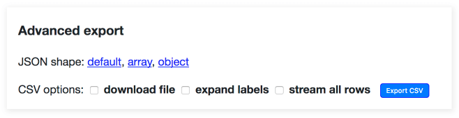

.. _csv_export:

CSV export
==========

Any Datasette table, view or custom SQL query can be exported as CSV.

To obtain the CSV representation of the table you are looking, click the "this
data as CSV" link.

You can also use the advanced export form for more control over the resulting
file, which looks like this and has the following options:

* **download file** - instead of displaying CSV in your browser, this forces
  your browser to download the CSV to your downloads directory.

* **expand labels** - if your table has any foreign key references this option
  will cause the CSV to gain additional ``COLUMN_NAME_label`` columns with a
  label for each foreign key derived from the linked table. `In this example
  <https://latest.datasette.io/fixtures/facetable.csv?_labels=on&_size=max>`_
  the ``city_id`` column is accompanied by a ``city_id_label`` column.

* **stream all rows** - by default CSV files only contain the first
  :ref:`setting_max_returned_rows` records. This option will cause Datasette to
  loop through every matching record and return them as a single CSV file.

You can try that out on https://latest.datasette.io/fixtures/facetable?_size=4

.. _csv_export_url_parameters:

URL parameters
--------------

The following options can be used to customize the CSVs returned by Datasette.

``?_header=off``
    This removes the first row of the CSV file specifying the headings - only the row data will be returned.

``?_stream=on``
    Stream all matching records, not just the first page of results. See below.

``?_dl=on``
    Causes Datasette to return a ``content-disposition: attachment; filename="filename.csv"`` header.

Streaming all records
---------------------

The *stream all rows* option is designed to be as efficient as possible -
under the hood it takes advantage of Python 3 asyncio capabilities and
Datasette's efficient :ref:`pagination <pagination>` to stream back the full
CSV file.

Since databases can get pretty large, by default this option is capped at 100MB -
if a table returns more than 100MB of data the last line of the CSV will be a
truncation error message.

You can increase or remove this limit using the :ref:`setting_max_csv_mb` config
setting. You can also disable the CSV export feature entirely using
:ref:`setting_allow_csv_stream`.

A note on URLs
--------------

The default URL for the CSV representation of a table is that table with
``.csv`` appended to it:

* https://latest.datasette.io/fixtures/facetable - HTML interface
* https://latest.datasette.io/fixtures/facetable.csv - CSV export
* https://latest.datasette.io/fixtures/facetable.json - JSON API

This pattern doesn't work for tables with names that already end in ``.csv`` or
``.json``. For those tables, you can instead use the ``_format=`` query string
parameter:

* https://latest.datasette.io/fixtures/table%2Fwith%2Fslashes.csv - HTML interface
* https://latest.datasette.io/fixtures/table%2Fwith%2Fslashes.csv?_format=csv - CSV export
* https://latest.datasette.io/fixtures/table%2Fwith%2Fslashes.csv?_format=json - JSON API
