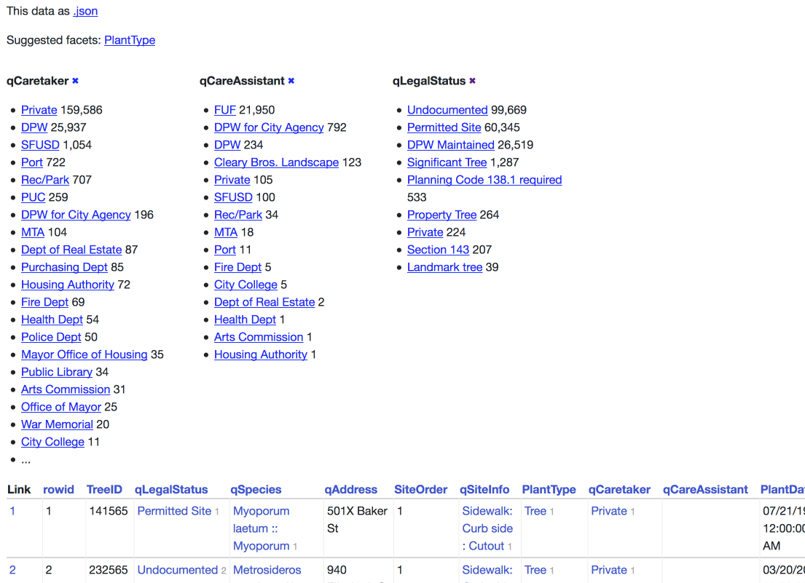

.. _facets:

Facets
======

Datasette facets can be used to add a faceted browse interface to any database table. With facets, tables are displayed along with a summary showing the most common values in specified columns. These values can be selected to further filter the table.

Facets can be specified in two ways: using querystring parameters, or in ``metadata.json`` configuration for the table.

Facets in querystrings
----------------------

To turn on faceting for specific columns on a Datasette table view, add one or more ``_facet=COLUMN`` parameters to the URL. For example, if you want to turn on facets for the ``city_id`` and ``state`` columns, construct a URL that looks like this::

    /dbname/tablename?_facet=state&_facet=city_id

This works for both the HTML interface and the ``.json`` view. When enabled, facets will cause a ``facet_results`` block to be added to the JSON output, looking something like this::

    {
      "state": {
        "name": "state",
        "results": [
          {
            "value": "CA",
            "label": "CA",
            "count": 10,
            "toggle_url": "http://...?_facet=city_id&_facet=state&state=CA",
            "selected": false
          },
          {
            "value": "MI",
            "label": "MI",
            "count": 4,
            "toggle_url": "http://...?_facet=city_id&_facet=state&state=MI",
            "selected": false
          },
          {
            "value": "MC",
            "label": "MC",
            "count": 1,
            "toggle_url": "http://...?_facet=city_id&_facet=state&state=MC",
            "selected": false
          }
        ],
        "truncated": false
      }
      "city_id": {
        "name": "city_id",
        "results": [
          {
            "value": 1,
            "label": "San Francisco",
            "count": 6,
            "toggle_url": "http://...?_facet=city_id&_facet=state&city_id=1",
            "selected": false
          },
          {
            "value": 2,
            "label": "Los Angeles",
            "count": 4,
            "toggle_url": "http://...?_facet=city_id&_facet=state&city_id=2",
            "selected": false
          },
          {
            "value": 3,
            "label": "Detroit",
            "count": 4,
            "toggle_url": "http://...?_facet=city_id&_facet=state&city_id=3",
            "selected": false
          },
          {
            "value": 4,
            "label": "Memnonia",
            "count": 1,
            "toggle_url": "http://...?_facet=city_id&_facet=state&city_id=4",
            "selected": false
          }
        ],
        "truncated": false
      }
    }

If Datasette detects that a column is a foreign key, the ``"label"`` property will be automatically derived from the detected label column on the referenced table.

Facets in metadata.json
-----------------------

You can turn facets on by default for specific tables by adding them to a ``"facets"`` key in a Datasette :ref:`metadata` file.

Here's an example that turns on faceting by default for the ``qLegalStatus`` column in the ``Street_Tree_List`` table in the ``sf-trees`` database::

    {
      "databases": {
        "sf-trees": {
          "tables": {
            "Street_Tree_List": {
              "facets": ["qLegalStatus"]
            }
          }
        }
      }
    }

Facets defined in this way will always be shown in the interface and returned in the API, regardless of the ``_facet`` arguments passed to the view.

Suggested facets
----------------

Datasette's table UI will suggest facets for the user to apply, based on the following criteria:

For the currently filtered data are there any columns which, if applied as a facet...

* Will return 30 or less unique options
* Will return more than one unique option
* Will return less unique options than the total number of filtered rows
* And the query used to evaluate this criteria can be completed in under 50ms

That last point is particularly important: Datasette runs a query for every column that is displayed on a page, which could get expensive - so to avoid slow load times it sets a time limit of just 50ms for each of those queries. This means suggested facets are unlikely to appear for tables with millions of records in them.

Speeding up facets with indexes
-------------------------------

The performance of facets can be greatly improved by adding indexes on the columns you wish to facet by. Adding indexes can be performed using the ``sqlite3`` command-line utility. Here's how to add an index on the ``state`` column in a table called ``Food_Trucks``::

    $ sqlite3 mydatabase.db
    SQLite version 3.19.3 2017-06-27 16:48:08
    Enter ".help" for usage hints.
    sqlite> CREATE INDEX Food_Trucks_state ON Food_Trucks("state");
