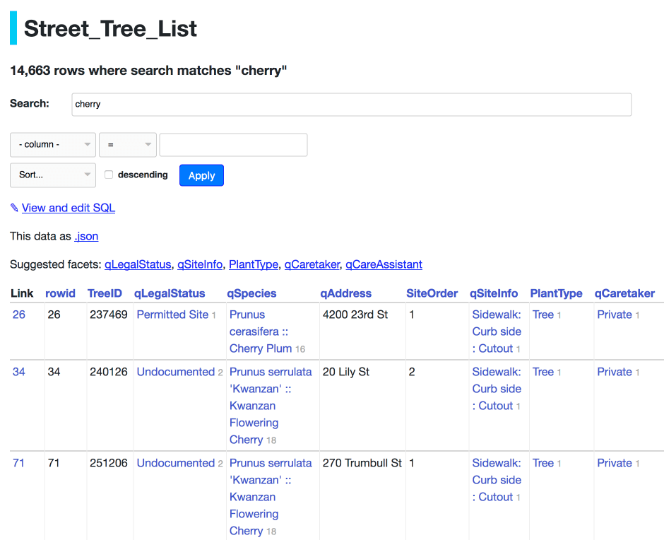

.. _full_text_search:

Full-text search
================

SQLite includes `a powerful mechanism for enabling full-text search <https://www.sqlite.org/fts3.html>`_ against SQLite records. Datasette can detect if a table has had full-text search configured for it in the underlying database and       display a search interface for filtering that table.

Datasette detects which tables have been configured for full-text search when it first inspects the database on startup (or via the ``datasette inspect`` command). You can visit the ``/-/inspect`` page on your Datasette instance to see the results of this inspection. Tables that have been configured for full-text search will have their ``fts_table`` property set to the name of another table (tables without full-text search will have this property set to ``null``).

FTS versions
------------

There are three different versions of the SQLite FTS module: FTS3, FTS4 and FTS5. You can tell which versions are supported by your instance of Datasette by checking the ``/-/versions`` page.

FTS5 is the most advanced module, but is usually not available is the SQLite version that is bundled with Python. If in doubt, you should use FTS4.

Adding full-text search to a SQLite table
-----------------------------------------

Datasette takes advantage of the `external content <https://www.sqlite.org/fts3.html#_external_content_fts4_tables_>`_ mechanism in SQLite, which allows a full-text search virtual table to be associated with the contents of another SQLite table.

To set up full-text search for a table, you need to do two things:

* Create a new FTS virtual table associated with your table
* Populate that FTS table with the data that you would like to be able to run searches against

To enable full-text search for a table called ``items`` that works against the ``name`` and ``description`` columns, you would run the following SQL to create a new ``items_fts`` FTS virtual table:

.. code-block:: sql

    CREATE VIRTUAL TABLE "items_fts" USING FTS4 (
        name,
        description,
        content="items"
    );

This creates a set of tables to power full-text search against ``items``. The new ``items_fts`` table will be detected by Datasette as the ``fts_table`` for the ``items`` table.

Creating the table is not enough: you also need to populate it with a copy of the data that you wish to make searchable. You can do that using the following SQL:

.. code-block:: sql

    INSERT INTO "items_fts" (rowid, name, description)
        SELECT rowid, name, description FROM items;

If your table has columns that are foreign key references to other tables you can include that data in your full-text search index using a join. Imagine the ``items`` table has a foreign key column called ``category_id`` which refers to a ``categories`` table - you could create a full-text search table like this:

.. code-block:: sql

    CREATE VIRTUAL TABLE "items_fts" USING FTS4 (
        name,
        description,
        category_name,
        content="items"
    );

And then populate it like this:

.. code-block:: sql

    INSERT INTO "items_fts" (rowid, name, description, category_name)
        SELECT items.rowid,
        items.name,
        items.description,
        categories.name
        FROM items JOIN categories ON items.category_id=categories.id;

You can use this technique to populate the full-text search index from any combination of tables and joins that makes sense for your project.

Configuring full-text search for a table or view
------------------------------------------------

If a table has a corresponding FTS table set up using the ``content=`` argument to ``CREATE VIRTUAL TABLE`` shown above, Datasette will detect it automatically and add a search interface to the table page for that table.

You can also manually configure which table should be used for full-text search using :ref:`metadata`. You can set the associated FTS table for a specific table and you can also set one for a view - if you do that, the page for that SQL view will offer a search option.

The ``fts_table`` property can be used to specify an associated FTS table. If the primary key column in your table which was used to populate the FTS table is something other than ``rowid``, you can specify the column to use with the ``fts_pk`` property.

Here is an example which enables full-text search for a ``display_ads`` view which is defined against the ``ads`` table and hence needs to run FTS against the ``ads_fts`` table, using the ``id`` as the primary key::

    {
      "databases": {
        "russian-ads": {
          "tables": {
            "display_ads": {
              "fts_table": "ads_fts",
              "fts_pk": "id"
            }
          }
        }
      }
    }

Setting up full-text search using csvs-to-sqlite
------------------------------------------------

If your data starts out in CSV files, you can use Datasette's companion tool `csvs-to-sqlite <https://github.com/simonw/csvs-to-sqlite>`_ to convert that file into a SQLite database and enable full-text search on specific columns. For a file called ``items.csv`` where you want full-text search to operate against the ``name`` and ``description`` columns you would run the following::

    csvs-to-sqlite items.csv items.db -f name -f description

The table view API
------------------

Table views that support full-text search can be queried using the ``?_search=TERMS`` querystring parameter. This will run the search against content from all of the columns that have been included in the index.

SQLite full-text search supports wildcards. This means you can easily implement prefix auto-complete by including an asterisk at the end of the search term - for example::

    /dbname/tablename/?_search=rob*

This will return all records containing at least one word that starts with the letters ``rob``.

You can also run searches against just the content of a specific named column by using ``_search_COLNAME=TERMS`` - for example, this would search for just rows where the ``name`` column in the FTS index mentions ``Sarah``::

    /dbname/tablename/?_search_name=Sarah

.. _full_text_search_custom_sql:

Searches using custom SQL
-------------------------

You can include full-text search results in custom SQL queries. The general pattern with SQLite search is to run the search as a sub-select that returns rowid values, then include those rowids in another part of the query.

You can see the syntax for a basic search by running that search on a table page and then clicking "View and edit SQL" to see the underlying SQL. For example, consider this search for `cherry trees in San Francisco <https://san-francisco.datasettes.com/sf-trees/Street_Tree_List?_search=cherry>`_::

    /sf-trees/Street_Tree_List?_search=cherry

If you click `View and edit SQL <https://san-francisco.datasettes.com/sf-trees?sql=select+rowid%2C+*+from+Street_Tree_List+where+rowid+in+(select+rowid+from+[Street_Tree_List_fts]+where+[Street_Tree_List_fts]+match+%3Asearch)+order+by+rowid+limit+101&search=cherry>`_ you'll see that the underlying SQL looks like this:

.. code-block:: sql

    select rowid, * from Street_Tree_List
    where rowid in (
        select rowid from [Street_Tree_List_fts]
        where [Street_Tree_List_fts] match "cherry"
    ) order by rowid limit 101
